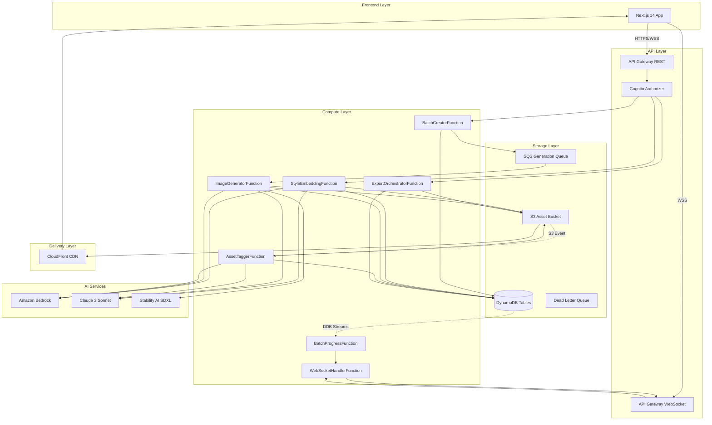
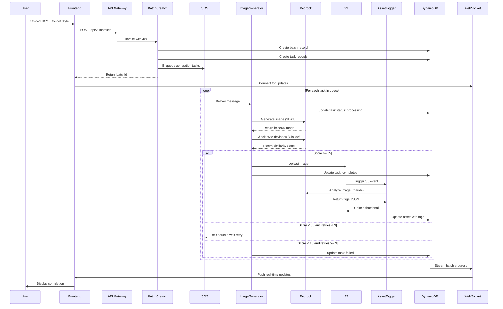

# Design Document: AssetQL Platform

## Overview

AssetQL is an AWS-native asset generation platform that enables users to create batches of AI-generated images with consistent style profiles using Amazon Bedrock. The system combines Bedrock's Claude 3 Sonnet for style analysis and prompt optimization with Stability AI SDXL for image generation. Users upload style reference images to create style profiles, then submit CSV files with prompt templates to generate batches of images that maintain visual consistency. The platform provides real-time batch monitoring via WebSocket, automatic asset tagging, searchable asset library, and platform-specific export capabilities (Unity, Shopify, social media formats).

The architecture follows serverless principles using Lambda functions for compute, DynamoDB for data persistence, S3 for asset storage, SQS for async task processing, CloudFront for secure content delivery, and Cognito for authentication. The system is designed for prototype-level throughput (10 concurrent image generations) with clear upgrade paths to SageMaker endpoints for production scale.

## Architecture




## Main Workflow Sequence




## Components and Interfaces

### Component 1: BatchCreatorFunction

**Purpose**: Orchestrates batch creation by parsing CSV files, applying prompt templates, and distributing generation tasks to SQS.

**Interface**:
```pascal
FUNCTION handleBatchCreation(event, context)
  INPUT: event (API Gateway event with CSV data, styleProfileId, config)
  OUTPUT: APIResponse (batchId, totalTasks, estimatedTime)
END FUNCTION

FUNCTION parseAndValidateCSV(csvContent)
  INPUT: csvContent (String)
  OUTPUT: ParsedData (rows[], columns[], isValid)
END FUNCTION

FUNCTION applyPromptTemplate(template, rowData, styleModifiers)
  INPUT: template (String), rowData (Object), styleModifiers (Array)
  OUTPUT: augmentedPrompt (String)
END FUNCTION

FUNCTION enqueueTasks(tasks, queueUrl)
  INPUT: tasks (Array of Task objects), queueUrl (String)
  OUTPUT: enqueueResult (successCount, failureCount)
END FUNCTION
```

**Responsibilities**:
- Validate CSV structure and required columns (prompt, variant_id minimum)
- Parse CSV rows and extract column mappings
- Fetch style profile from DynamoDB and extract style modifiers
- Apply template variable substitution for each row
- Create batch record with status: queued
- Generate task records for each CSV row
- Batch-enqueue SQS messages (10 per batch)
- Return batch metadata to caller


### Component 2: StyleEmbeddingFunction

**Purpose**: Processes style reference images using Bedrock Claude 3 vision to extract style descriptors for consistent image generation.

**Interface**:
```pascal
FUNCTION handleStyleCreation(event, context)
  INPUT: event (multipart form with images[], profileName, userId)
  OUTPUT: APIResponse (styleProfileId, descriptors)
END FUNCTION

FUNCTION analyzeStyleImage(imageBuffer, imageFormat)
  INPUT: imageBuffer (Binary), imageFormat (String)
  OUTPUT: StyleDescriptors (colorPalette[], composition, texture, lighting, artStyle, mood)
END FUNCTION

FUNCTION mergeStyleDescriptors(descriptorsArray)
  INPUT: descriptorsArray (Array of StyleDescriptors)
  OUTPUT: mergedDescriptors (StyleDescriptors)
END FUNCTION
```

**Responsibilities**:
- Validate uploaded images (format: JPEG/PNG/WebP, max 10MB each, 1-5 images)
- Upload reference images to S3 style-references/{styleId}/
- Invoke Bedrock Claude 3 Sonnet vision mode for each image
- Parse JSON response containing style descriptors
- Merge descriptors across multiple reference images
- Store style profile in DynamoDB with locked parameter flags
- Return styleProfileId to caller


### Component 3: ImageGeneratorFunction

**Purpose**: Core image generation worker that processes SQS tasks, generates images via Bedrock SDXL, validates style consistency, and manages retries.

**Interface**:
```pascal
FUNCTION handleSQSEvent(event, context)
  INPUT: event (SQS event with batch of 1 message)
  OUTPUT: ProcessingResult (success, taskId, assetId or error)
END FUNCTION

FUNCTION generateImage(prompt, config)
  INPUT: prompt (String), config (width, height, steps, cfgScale)
  OUTPUT: GeneratedImage (base64Data, format)
END FUNCTION

FUNCTION validateStyleConsistency(imageBuffer, styleDescriptors)
  INPUT: imageBuffer (Binary), styleDescriptors (Object)
  OUTPUT: ValidationResult (score, passed, feedback)
END FUNCTION

FUNCTION handleRetry(taskData, retryCount)
  INPUT: taskData (Object), retryCount (Integer)
  OUTPUT: RetryDecision (shouldRetry, newMessage or failReason)
END FUNCTION
```

**Responsibilities**:
- Receive SQS message with task details
- Update task status to processing in DynamoDB
- Fetch style profile and build augmented prompt
- Invoke Bedrock SDXL for image generation
- Parse base64-encoded image from response
- Validate style consistency using Claude 3 vision
- Handle retry logic (max 3 attempts) for low-scoring images
- Upload successful images to S3 raw/{batchId}/{assetId}.png
- Create asset record in DynamoDB
- Update task status and batch progress atomically


### Component 4: AssetTaggerFunction

**Purpose**: Automatically analyzes generated images using Bedrock Claude 3 vision to extract tags, categories, and metadata for searchability.

**Interface**:
```pascal
FUNCTION handleS3Event(event, context)
  INPUT: event (S3 ObjectCreated event)
  OUTPUT: ProcessingResult (assetId, tagsAdded, thumbnailCreated)
END FUNCTION

FUNCTION analyzeImageContent(imageBuffer)
  INPUT: imageBuffer (Binary)
  OUTPUT: ImageAnalysis (objects[], scene, colors[], mood, style, composition)
END FUNCTION

FUNCTION generateThumbnail(imageBuffer, targetSize)
  INPUT: imageBuffer (Binary), targetSize (width, height)
  OUTPUT: thumbnailBuffer (Binary)
END FUNCTION

FUNCTION flattenToTags(analysisResult)
  INPUT: analysisResult (ImageAnalysis)
  OUTPUT: tags (Array of Strings)
END FUNCTION
```

**Responsibilities**:
- Triggered by S3 event on object creation under raw/ prefix
- Download newly created image from S3
- Invoke Bedrock Claude 3 vision with tagging prompt
- Parse JSON response with structured metadata
- Flatten analysis into searchable tag array
- Generate 256x256 thumbnail using Sharp library
- Upload thumbnail to S3 thumbnails/{assetId}_thumb.jpg
- Update asset record in DynamoDB with tags and thumbnail key


### Component 5: ExportOrchestratorFunction

**Purpose**: Packages selected assets into platform-specific formats with appropriate resizing, metadata, and delivery via CloudFront signed URLs.

**Interface**:
```pascal
FUNCTION handleExportRequest(event, context)
  INPUT: event (assetIds[], platform, formats[], userId)
  OUTPUT: APIResponse (exportId, downloadUrl, expiresAt)
END FUNCTION

FUNCTION resizeForPlatform(imageBuffer, platform, format)
  INPUT: imageBuffer (Binary), platform (String), format (String)
  OUTPUT: resizedImages (Array of {buffer, filename, dimensions})
END FUNCTION

FUNCTION createExportBundle(assets, metadata)
  INPUT: assets (Array of asset data), metadata (Object)
  OUTPUT: zipBuffer (Binary)
END FUNCTION

FUNCTION generateSignedURL(s3Key, expirySeconds)
  INPUT: s3Key (String), expirySeconds (Integer)
  OUTPUT: signedUrl (String)
END FUNCTION
```

**Responsibilities**:
- Validate asset access permissions for userId
- Download selected assets from S3
- Apply platform-specific transformations (Unity: PNG/TGA, Shopify: 3 JPEG sizes, Social: platform dimensions)
- Generate metadata.json with asset mappings and prompts
- Bundle files into ZIP archive using archiver library
- Upload ZIP to S3 exports/{exportId}.zip
- Generate CloudFront signed URL with 7-day expiry
- Return download URL to caller


### Component 6: WebSocketHandlerFunction

**Purpose**: Manages WebSocket connections and broadcasts real-time batch progress updates to connected clients.

**Interface**:
```pascal
FUNCTION handleWebSocketEvent(event, context)
  INPUT: event (WebSocket route event: $connect, $disconnect, $default)
  OUTPUT: WebSocketResponse (statusCode, connectionId)
END FUNCTION

FUNCTION registerConnection(connectionId, userId)
  INPUT: connectionId (String), userId (String)
  OUTPUT: success (Boolean)
END FUNCTION

FUNCTION broadcastToUser(userId, message)
  INPUT: userId (String), message (Object)
  OUTPUT: BroadcastResult (deliveredCount, failedConnections[])
END FUNCTION

FUNCTION cleanupConnection(connectionId)
  INPUT: connectionId (String)
  OUTPUT: success (Boolean)
END FUNCTION
```

**Responsibilities**:
- Handle $connect route: store connectionId and userId in DynamoDB
- Handle $disconnect route: remove connection record
- Handle broadcast requests from BatchProgressFunction
- Query all active connections for a userId
- Send JSON payloads via API Gateway Management API
- Handle stale connections and cleanup failures
- Return delivery status to caller


### Component 7: BatchProgressFunction

**Purpose**: Monitors DynamoDB Streams for task status changes and triggers WebSocket notifications when batches complete.

**Interface**:
```pascal
FUNCTION handleDynamoDBStream(event, context)
  INPUT: event (DynamoDB Stream records)
  OUTPUT: ProcessingResult (batchesUpdated[], notificationsSent)
END FUNCTION

FUNCTION detectBatchCompletion(batchId)
  INPUT: batchId (String)
  OUTPUT: CompletionStatus (isComplete, completedTasks, failedTasks, totalTasks)
END FUNCTION

FUNCTION calculateBatchMetrics(batchId)
  INPUT: batchId (String)
  OUTPUT: BatchMetrics (avgStyleScore, totalDuration, successRate)
END FUNCTION
```

**Responsibilities**:
- Process DynamoDB Stream records from AssetQL-tasks table
- Filter for status attribute changes
- Query batch record for current progress
- Detect batch completion (completedTasks + failedTasks == totalTasks)
- Calculate aggregate metrics (average style score, duration)
- Update batch status to completed in DynamoDB
- Invoke WebSocketHandlerFunction to broadcast completion
- Handle partial failures gracefully


## Data Models

### Model 1: Batch

```pascal
STRUCTURE Batch
  batchId: UUID (PK)
  userId: String (GSI: userId-createdAt-index)
  name: String
  description: String
  styleProfileId: UUID
  csvS3Key: String
  promptTemplate: String
  totalTasks: Integer
  completedTasks: Integer
  failedTasks: Integer
  status: Enum (queued, processing, completed, failed)
  config: Object
    width: Integer
    height: Integer
    steps: Integer
    cfgScale: Float
    concurrencyLimit: Integer
  metrics: Object
    avgStyleScore: Float
    totalDurationMs: Integer
    successRate: Float
  createdAt: ISO8601Timestamp
  updatedAt: ISO8601Timestamp
  completedAt: ISO8601Timestamp (nullable)
END STRUCTURE
```

**Validation Rules**:
- batchId must be valid UUID v4
- userId must match authenticated user from JWT
- totalTasks must be > 0 and <= 500 for prototype
- status transitions: queued → processing → (completed | failed)
- config.width and config.height must be multiples of 64 (SDXL requirement)
- config.steps must be between 20 and 50
- config.cfgScale must be between 1.0 and 20.0


### Model 2: Asset

```pascal
STRUCTURE Asset
  assetId: UUID (PK)
  batchId: UUID (GSI: batchId-createdAt-index)
  userId: String (GSI: userId-category-index)
  taskId: UUID
  s3Key: String
  thumbnailS3Key: String
  cloudFrontUrl: String
  prompt: String
  negativePrompt: String
  styleScore: Float
  category: String
  tags: Array of String
  metadata: Object
    width: Integer
    height: Integer
    format: String
    sizeBytes: Integer
    generationDurationMs: Integer
  analysis: Object
    objects: Array of String
    scene: String
    colors: Array of String (hex codes)
    mood: String
    style: String
    composition: String
  createdAt: ISO8601Timestamp
  updatedAt: ISO8601Timestamp
END STRUCTURE
```

**Validation Rules**:
- assetId must be valid UUID v4
- batchId must reference existing batch
- userId must match batch owner
- s3Key must follow pattern: raw/{batchId}/{assetId}.png
- styleScore must be between 0 and 100
- tags array must contain 3-20 elements
- metadata.format must be one of: PNG, JPEG, WebP
- cloudFrontUrl must be valid HTTPS URL


### Model 3: StyleProfile

```pascal
STRUCTURE StyleProfile
  styleProfileId: UUID (PK)
  userId: String (GSI: userId-createdAt-index)
  name: String
  description: String
  referenceImages: Array of Object
    s3Key: String
    url: String
    uploadedAt: ISO8601Timestamp
  descriptors: Object
    colorPalette: Array of String (hex codes, top 5)
    composition: String
    texture: String
    lighting: String
    artStyle: String
    mood: String
  lockedParameters: Object
    colorPalette: Boolean
    composition: Boolean
    texture: Boolean
    lighting: Boolean
  deviationThreshold: Float (0-100, default 85)
  usageCount: Integer
  createdAt: ISO8601Timestamp
  updatedAt: ISO8601Timestamp
END STRUCTURE
```

**Validation Rules**:
- styleProfileId must be valid UUID v4
- userId must match authenticated user
- referenceImages array must contain 1-5 elements
- descriptors.colorPalette must contain exactly 5 hex color codes
- deviationThreshold must be between 70 and 95
- All descriptor fields must be non-empty strings
- lockedParameters flags control which descriptors are enforced during generation


### Model 4: Task

```pascal
STRUCTURE Task
  taskId: UUID (PK)
  batchId: UUID (SK, GSI: batchId-status-index)
  userId: String
  rowIndex: Integer
  prompt: String
  augmentedPrompt: String
  negativePrompt: String
  status: Enum (queued, processing, completed, failed)
  retryCount: Integer
  assetId: UUID (nullable)
  styleScore: Float (nullable)
  errorMessage: String (nullable)
  sqsMessageId: String
  startedAt: ISO8601Timestamp (nullable)
  completedAt: ISO8601Timestamp (nullable)
  durationMs: Integer (nullable)
  createdAt: ISO8601Timestamp
  updatedAt: ISO8601Timestamp
END STRUCTURE
```

**Validation Rules**:
- taskId must be valid UUID v4
- batchId must reference existing batch
- rowIndex must be >= 0 and < batch.totalTasks
- status transitions: queued → processing → (completed | failed)
- retryCount must be >= 0 and <= 3
- styleScore only populated when status is completed
- errorMessage only populated when status is failed
- durationMs calculated as completedAt - startedAt


### Model 5: WebSocketConnection

```pascal
STRUCTURE WebSocketConnection
  connectionId: String (PK)
  userId: String
  connectedAt: ISO8601Timestamp
  lastPingAt: ISO8601Timestamp
  ttl: Integer (Unix timestamp for DynamoDB TTL)
END STRUCTURE
```

**Validation Rules**:
- connectionId provided by API Gateway WebSocket
- userId extracted from JWT during $connect
- ttl set to connectedAt + 2 hours for automatic cleanup
- lastPingAt updated on each message to detect stale connections

## Algorithmic Pseudocode

### Main Processing Algorithm: Batch Creation Workflow

```pascal
ALGORITHM processBatchCreation(csvContent, styleProfileId, config, userId)
INPUT: csvContent (String), styleProfileId (UUID), config (Object), userId (String)
OUTPUT: result (Object with batchId, totalTasks, estimatedTime)

BEGIN
  ASSERT csvContent IS NOT NULL AND csvContent.length > 0
  ASSERT styleProfileId IS valid UUID
  ASSERT userId IS authenticated
  
  // Step 1: Parse and validate CSV
  parsedData ← parseCSV(csvContent)
  ASSERT parsedData.isValid = true
  ASSERT parsedData.rows.length > 0 AND parsedData.rows.length <= 500
  ASSERT "prompt" IN parsedData.columns
  
  // Step 2: Fetch style profile
  styleProfile ← dynamoDB.getItem("AssetQL-styles", styleProfileId)
  ASSERT styleProfile IS NOT NULL
  ASSERT styleProfile.userId = userId
  
  styleModifiers ← buildStyleModifiers(styleProfile.descriptors, styleProfile.lockedParameters)
  
  // Step 3: Create batch record
  batchId ← generateUUID()
  batch ← {
    batchId: batchId,
    userId: userId,
    styleProfileId: styleProfileId,
    totalTasks: parsedData.rows.length,
    completedTasks: 0,
    failedTasks: 0,
    status: "queued",
    config: config,
    createdAt: now()
  }
  dynamoDB.putItem("AssetQL-batches", batch)
  
  // Step 4: Create task records with loop invariant
  tasks ← []
  FOR i FROM 0 TO parsedData.rows.length - 1 DO
    ASSERT tasks.length = i
    
    row ← parsedData.rows[i]
    taskId ← generateUUID()
    augmentedPrompt ← applyTemplate(config.promptTemplate, row, styleModifiers)
    
    task ← {
      taskId: taskId,
      batchId: batchId,
      userId: userId,
      rowIndex: i,
      prompt: row.prompt,
      augmentedPrompt: augmentedPrompt,
      status: "queued",
      retryCount: 0,
      createdAt: now()
    }
    tasks.add(task)
  END FOR
  
  ASSERT tasks.length = parsedData.rows.length
  
  // Step 5: Batch write tasks to DynamoDB
  dynamoDB.batchWriteItems("AssetQL-tasks", tasks)
  
  // Step 6: Enqueue SQS messages in batches of 10
  sqsMessages ← []
  FOR each task IN tasks DO
    message ← {
      batchId: task.batchId,
      taskId: task.taskId,
      prompt: task.augmentedPrompt,
      styleProfileId: styleProfileId,
      config: config,
      retryCount: 0
    }
    sqsMessages.add(message)
    
    IF sqsMessages.length = 10 THEN
      sqs.sendMessageBatch(GENERATION_QUEUE_URL, sqsMessages)
      sqsMessages ← []
    END IF
  END FOR
  
  // Send remaining messages
  IF sqsMessages.length > 0 THEN
    sqs.sendMessageBatch(GENERATION_QUEUE_URL, sqsMessages)
  END IF
  
  // Step 7: Calculate estimated time
  estimatedTimeSeconds ← (tasks.length / config.concurrencyLimit) * 45
  
  result ← {
    batchId: batchId,
    totalTasks: tasks.length,
    estimatedTime: estimatedTimeSeconds
  }
  
  RETURN result
END
```

**Preconditions**:
- csvContent is valid CSV format with header row
- styleProfileId references existing style profile owned by userId
- config contains valid generation parameters
- userId is authenticated via Cognito JWT

**Postconditions**:
- Batch record created in DynamoDB with status: queued
- All task records created with status: queued
- All tasks enqueued to SQS generation queue
- Returns valid batchId and task count

**Loop Invariants**:
- tasks.length equals current iteration index i
- All previously created tasks have valid taskId and batchId
- All tasks maintain referential integrity to batch record


### Image Generation Algorithm with Style Validation

```pascal
ALGORITHM processImageGenerationTask(sqsMessage)
INPUT: sqsMessage (Object with batchId, taskId, prompt, styleProfileId, config, retryCount)
OUTPUT: result (Object with success, assetId or errorMessage)

BEGIN
  ASSERT sqsMessage.taskId IS valid UUID
  ASSERT sqsMessage.retryCount >= 0 AND sqsMessage.retryCount <= 3
  
  taskId ← sqsMessage.taskId
  batchId ← sqsMessage.batchId
  
  // Step 1: Update task status to processing
  startTime ← now()
  dynamoDB.updateItem("AssetQL-tasks", taskId, {
    status: "processing",
    startedAt: startTime
  })
  
  // Step 2: Fetch style profile for validation
  styleProfile ← dynamoDB.getItem("AssetQL-styles", sqsMessage.styleProfileId)
  ASSERT styleProfile IS NOT NULL
  
  // Step 3: Build Bedrock SDXL request
  bedrockRequest ← {
    modelId: "stability.stable-diffusion-xl-v1",
    contentType: "application/json",
    accept: "application/json",
    body: JSON.stringify({
      text_prompts: [
        {text: sqsMessage.prompt, weight: 1.0}
      ],
      negative_prompts: [
        {text: "blurry, low quality, distorted", weight: -1.0}
      ],
      width: sqsMessage.config.width,
      height: sqsMessage.config.height,
      steps: sqsMessage.config.steps,
      cfg_scale: sqsMessage.config.cfgScale,
      seed: random(0, 4294967295)
    })
  }
  
  // Step 4: Invoke Bedrock for image generation
  TRY
    bedrockResponse ← bedrock.invokeModel(bedrockRequest)
    responseBody ← JSON.parse(bedrockResponse.body)
    base64Image ← responseBody.artifacts[0].base64
    imageBuffer ← base64Decode(base64Image)
  CATCH error
    RETURN handleGenerationError(taskId, batchId, error, sqsMessage)
  END TRY
  
  // Step 5: Validate style consistency using Claude 3 vision
  styleScore ← validateStyleConsistency(imageBuffer, styleProfile.descriptors)
  
  // Step 6: Decide on retry or acceptance
  IF styleScore < styleProfile.deviationThreshold THEN
    IF sqsMessage.retryCount < 3 THEN
      // Re-enqueue with incremented retry count
      newMessage ← sqsMessage
      newMessage.retryCount ← sqsMessage.retryCount + 1
      sqs.sendMessage(GENERATION_QUEUE_URL, newMessage)
      
      // Delete current message
      sqs.deleteMessage(GENERATION_QUEUE_URL, sqsMessage.receiptHandle)
      
      RETURN {success: false, reason: "retry", styleScore: styleScore}
    ELSE
      // Max retries exceeded, mark as failed
      dynamoDB.updateItem("AssetQL-tasks", taskId, {
        status: "failed",
        errorMessage: "Style validation failed after 3 retries",
        styleScore: styleScore,
        completedAt: now()
      })
      
      dynamoDB.updateItem("AssetQL-batches", batchId, {
        failedTasks: INCREMENT(1)
      })
      
      RETURN {success: false, reason: "max_retries", styleScore: styleScore}
    END IF
  END IF
  
  // Step 7: Style validation passed, save asset
  assetId ← generateUUID()
  s3Key ← "raw/" + batchId + "/" + assetId + ".png"
  
  s3.putObject(ASSET_BUCKET, s3Key, imageBuffer, {
    ContentType: "image/png",
    Metadata: {
      taskId: taskId,
      batchId: batchId,
      styleScore: toString(styleScore)
    }
  })
  
  // Step 8: Create asset record
  asset ← {
    assetId: assetId,
    batchId: batchId,
    userId: styleProfile.userId,
    taskId: taskId,
    s3Key: s3Key,
    prompt: sqsMessage.prompt,
    styleScore: styleScore,
    metadata: {
      width: sqsMessage.config.width,
      height: sqsMessage.config.height,
      format: "PNG",
      sizeBytes: imageBuffer.length,
      generationDurationMs: now() - startTime
    },
    createdAt: now()
  }
  dynamoDB.putItem("AssetQL-assets", asset)
  
  // Step 9: Update task and batch atomically
  dynamoDB.updateItem("AssetQL-tasks", taskId, {
    status: "completed",
    assetId: assetId,
    styleScore: styleScore,
    completedAt: now(),
    durationMs: now() - startTime
  })
  
  dynamoDB.updateItem("AssetQL-batches", batchId, {
    completedTasks: INCREMENT(1)
  })
  
  // Step 10: Delete SQS message
  sqs.deleteMessage(GENERATION_QUEUE_URL, sqsMessage.receiptHandle)
  
  RETURN {success: true, assetId: assetId, styleScore: styleScore}
END
```

**Preconditions**:
- sqsMessage contains valid taskId, batchId, and styleProfileId
- Task record exists in DynamoDB with status: queued
- Style profile exists and is accessible
- Bedrock SDXL model is available in region
- retryCount is between 0 and 3

**Postconditions**:
- If successful: asset uploaded to S3, asset record created, task marked completed
- If retry needed: new message enqueued with incremented retryCount
- If failed: task marked failed, batch failedTasks incremented
- SQS message always deleted from queue
- Batch progress counters updated atomically

**Loop Invariants**: N/A (no loops in main flow)


### Style Consistency Validation Algorithm

```pascal
ALGORITHM validateStyleConsistency(imageBuffer, styleDescriptors)
INPUT: imageBuffer (Binary), styleDescriptors (Object)
OUTPUT: styleScore (Float between 0 and 100)

BEGIN
  ASSERT imageBuffer IS NOT NULL AND imageBuffer.length > 0
  ASSERT styleDescriptors IS NOT NULL
  
  // Step 1: Convert image to base64 for Bedrock
  base64Image ← base64Encode(imageBuffer)
  
  // Step 2: Build validation prompt
  validationPrompt ← buildValidationPrompt(styleDescriptors)
  
  // Step 3: Invoke Bedrock Claude 3 Sonnet with vision
  claudeRequest ← {
    modelId: "anthropic.claude-3-sonnet-20240229-v1:0",
    contentType: "application/json",
    accept: "application/json",
    body: JSON.stringify({
      anthropic_version: "bedrock-2023-05-31",
      max_tokens: 1000,
      messages: [
        {
          role: "user",
          content: [
            {
              type: "image",
              source: {
                type: "base64",
                media_type: "image/png",
                data: base64Image
              }
            },
            {
              type: "text",
              text: validationPrompt
            }
          ]
        }
      ]
    })
  }
  
  TRY
    claudeResponse ← bedrock.invokeModel(claudeRequest)
    responseBody ← JSON.parse(claudeResponse.body)
    responseText ← responseBody.content[0].text
    
    // Step 4: Parse JSON response
    analysisResult ← JSON.parse(responseText)
    
    // Step 5: Calculate weighted similarity score
    colorScore ← compareColorPalettes(
      analysisResult.colors,
      styleDescriptors.colorPalette
    )
    
    compositionScore ← compareSemantic(
      analysisResult.composition,
      styleDescriptors.composition
    )
    
    textureScore ← compareSemantic(
      analysisResult.texture,
      styleDescriptors.texture
    )
    
    lightingScore ← compareSemantic(
      analysisResult.lighting,
      styleDescriptors.lighting
    )
    
    artStyleScore ← compareSemantic(
      analysisResult.artStyle,
      styleDescriptors.artStyle
    )
    
    moodScore ← compareSemantic(
      analysisResult.mood,
      styleDescriptors.mood
    )
    
    // Step 6: Weighted average (color and artStyle weighted higher)
    totalScore ← (
      colorScore * 0.25 +
      compositionScore * 0.15 +
      textureScore * 0.15 +
      lightingScore * 0.15 +
      artStyleScore * 0.20 +
      moodScore * 0.10
    )
    
    ASSERT totalScore >= 0 AND totalScore <= 100
    
    RETURN totalScore
    
  CATCH error
    // On validation error, return neutral score to avoid blocking
    logError("Style validation failed", error)
    RETURN 85.0
  END TRY
END

FUNCTION buildValidationPrompt(styleDescriptors)
  INPUT: styleDescriptors (Object)
  OUTPUT: prompt (String)
BEGIN
  prompt ← "Analyze this image and return ONLY valid JSON with this structure:\n"
  prompt ← prompt + "{\n"
  prompt ← prompt + '  "colors": ["#hex1", "#hex2", "#hex3", "#hex4", "#hex5"],\n'
  prompt ← prompt + '  "composition": "description",\n'
  prompt ← prompt + '  "texture": "description",\n'
  prompt ← prompt + '  "lighting": "description",\n'
  prompt ← prompt + '  "artStyle": "description",\n'
  prompt ← prompt + '  "mood": "description"\n'
  prompt ← prompt + "}\n\n"
  prompt ← prompt + "Expected style characteristics:\n"
  prompt ← prompt + "- Color palette: " + join(styleDescriptors.colorPalette, ", ") + "\n"
  prompt ← prompt + "- Composition: " + styleDescriptors.composition + "\n"
  prompt ← prompt + "- Texture: " + styleDescriptors.texture + "\n"
  prompt ← prompt + "- Lighting: " + styleDescriptors.lighting + "\n"
  prompt ← prompt + "- Art style: " + styleDescriptors.artStyle + "\n"
  prompt ← prompt + "- Mood: " + styleDescriptors.mood
  
  RETURN prompt
END

FUNCTION compareColorPalettes(generatedColors, referenceColors)
  INPUT: generatedColors (Array of hex strings), referenceColors (Array of hex strings)
  OUTPUT: similarity (Float between 0 and 100)
BEGIN
  matchCount ← 0
  
  FOR each genColor IN generatedColors DO
    FOR each refColor IN referenceColors DO
      distance ← colorDistance(genColor, refColor)
      IF distance < 30 THEN  // Threshold for "similar" colors
        matchCount ← matchCount + 1
        BREAK
      END IF
    END FOR
  END FOR
  
  similarity ← (matchCount / referenceColors.length) * 100
  RETURN similarity
END

FUNCTION compareSemantic(generatedText, referenceText)
  INPUT: generatedText (String), referenceText (String)
  OUTPUT: similarity (Float between 0 and 100)
BEGIN
  // Simple keyword-based similarity for prototype
  // Post-prototype: replace with embedding-based cosine similarity
  
  genWords ← toLowerCase(generatedText).split(" ")
  refWords ← toLowerCase(referenceText).split(" ")
  
  matchCount ← 0
  FOR each word IN genWords DO
    IF word IN refWords THEN
      matchCount ← matchCount + 1
    END IF
  END FOR
  
  similarity ← (matchCount / max(genWords.length, refWords.length)) * 100
  RETURN min(similarity, 100)
END
```

**Preconditions**:
- imageBuffer contains valid PNG image data
- styleDescriptors contains all required fields (colorPalette, composition, texture, lighting, artStyle, mood)
- Bedrock Claude 3 Sonnet model is available

**Postconditions**:
- Returns score between 0 and 100
- Score >= 85 indicates acceptable style match
- On error, returns neutral score of 85 to avoid blocking pipeline

**Loop Invariants**:
- In compareColorPalettes: matchCount <= current iteration index
- In compareSemantic: matchCount <= genWords.length


### Style Extraction Algorithm

```pascal
ALGORITHM extractStyleFromImages(imageBuffers, profileName, userId)
INPUT: imageBuffers (Array of Binary), profileName (String), userId (String)
OUTPUT: styleProfile (StyleProfile object)

BEGIN
  ASSERT imageBuffers.length >= 1 AND imageBuffers.length <= 5
  ASSERT profileName IS NOT NULL AND profileName.length > 0
  
  styleProfileId ← generateUUID()
  allDescriptors ← []
  referenceImages ← []
  
  // Step 1: Process each reference image
  FOR i FROM 0 TO imageBuffers.length - 1 DO
    ASSERT allDescriptors.length = i
    
    imageBuffer ← imageBuffers[i]
    
    // Upload to S3
    s3Key ← "style-references/" + styleProfileId + "/reference_" + i + ".png"
    s3.putObject(ASSET_BUCKET, s3Key, imageBuffer, {
      ContentType: "image/png"
    })
    
    referenceImages.add({
      s3Key: s3Key,
      url: buildCloudFrontUrl(s3Key),
      uploadedAt: now()
    })
    
    // Analyze with Claude 3 vision
    base64Image ← base64Encode(imageBuffer)
    
    analysisPrompt ← buildStyleAnalysisPrompt()
    
    claudeRequest ← {
      modelId: "anthropic.claude-3-sonnet-20240229-v1:0",
      contentType: "application/json",
      accept: "application/json",
      body: JSON.stringify({
        anthropic_version: "bedrock-2023-05-31",
        max_tokens: 2000,
        messages: [
          {
            role: "user",
            content: [
              {
                type: "image",
                source: {
                  type: "base64",
                  media_type: "image/png",
                  data: base64Image
                }
              },
              {
                type: "text",
                text: analysisPrompt
              }
            ]
          }
        ]
      })
    }
    
    claudeResponse ← bedrock.invokeModel(claudeRequest)
    responseBody ← JSON.parse(claudeResponse.body)
    responseText ← responseBody.content[0].text
    
    descriptors ← JSON.parse(responseText)
    allDescriptors.add(descriptors)
  END FOR
  
  ASSERT allDescriptors.length = imageBuffers.length
  
  // Step 2: Merge descriptors across all images
  mergedDescriptors ← mergeStyleDescriptors(allDescriptors)
  
  // Step 3: Create style profile record
  styleProfile ← {
    styleProfileId: styleProfileId,
    userId: userId,
    name: profileName,
    referenceImages: referenceImages,
    descriptors: mergedDescriptors,
    lockedParameters: {
      colorPalette: true,
      composition: true,
      texture: true,
      lighting: true
    },
    deviationThreshold: 85.0,
    usageCount: 0,
    createdAt: now()
  }
  
  dynamoDB.putItem("AssetQL-styles", styleProfile)
  
  RETURN styleProfile
END

FUNCTION buildStyleAnalysisPrompt()
  OUTPUT: prompt (String)
BEGIN
  prompt ← "Analyze this image's visual style and return ONLY valid JSON:\n"
  prompt ← prompt + "{\n"
  prompt ← prompt + '  "colorPalette": ["#hex1", "#hex2", "#hex3", "#hex4", "#hex5"],\n'
  prompt ← prompt + '  "composition": "detailed description of layout and structure",\n'
  prompt ← prompt + '  "texture": "description of surface qualities and details",\n'
  prompt ← prompt + '  "lighting": "description of light sources and shadows",\n'
  prompt ← prompt + '  "artStyle": "specific art style or technique",\n'
  prompt ← prompt + '  "mood": "emotional tone and atmosphere"\n'
  prompt ← prompt + "}\n\n"
  prompt ← prompt + "Extract the 5 most dominant colors as hex codes.\n"
  prompt ← prompt + "Be specific and detailed in all descriptions."
  
  RETURN prompt
END

FUNCTION mergeStyleDescriptors(descriptorsArray)
  INPUT: descriptorsArray (Array of descriptor objects)
  OUTPUT: merged (Object)
BEGIN
  IF descriptorsArray.length = 1 THEN
    RETURN descriptorsArray[0]
  END IF
  
  // Merge color palettes by frequency
  allColors ← []
  FOR each desc IN descriptorsArray DO
    FOR each color IN desc.colorPalette DO
      allColors.add(color)
    END FOR
  END FOR
  
  colorFrequency ← countColorFrequency(allColors)
  topColors ← getTopN(colorFrequency, 5)
  
  // Merge text descriptors by concatenation
  compositions ← []
  textures ← []
  lightings ← []
  artStyles ← []
  moods ← []
  
  FOR each desc IN descriptorsArray DO
    compositions.add(desc.composition)
    textures.add(desc.texture)
    lightings.add(desc.lighting)
    artStyles.add(desc.artStyle)
    moods.add(desc.mood)
  END FOR
  
  merged ← {
    colorPalette: topColors,
    composition: findCommonThemes(compositions),
    texture: findCommonThemes(textures),
    lighting: findCommonThemes(lightings),
    artStyle: findMostFrequent(artStyles),
    mood: findCommonThemes(moods)
  }
  
  RETURN merged
END
```

**Preconditions**:
- imageBuffers contains 1-5 valid image buffers
- Each image is JPEG, PNG, or WebP format
- Each image is <= 10MB
- userId is authenticated
- profileName is non-empty string

**Postconditions**:
- All reference images uploaded to S3
- Style profile created in DynamoDB
- Descriptors contain all required fields
- colorPalette contains exactly 5 hex codes
- Returns valid StyleProfile object

**Loop Invariants**:
- allDescriptors.length equals current iteration index i
- All previously processed images have been uploaded to S3
- All descriptors in allDescriptors are valid JSON objects


### Asset Tagging Algorithm

```pascal
ALGORITHM tagGeneratedAsset(s3Event)
INPUT: s3Event (S3 ObjectCreated event)
OUTPUT: result (Object with assetId, tagsAdded, thumbnailCreated)

BEGIN
  ASSERT s3Event.eventName = "ObjectCreated:Put"
  
  // Step 1: Extract asset information from S3 event
  s3Key ← s3Event.s3.object.key
  ASSERT s3Key STARTS WITH "raw/"
  
  // Parse: raw/{batchId}/{assetId}.png
  pathParts ← s3Key.split("/")
  batchId ← pathParts[1]
  filename ← pathParts[2]
  assetId ← filename.replace(".png", "")
  
  // Step 2: Download image from S3
  imageBuffer ← s3.getObject(ASSET_BUCKET, s3Key)
  ASSERT imageBuffer IS NOT NULL
  
  // Step 3: Analyze image with Claude 3 vision
  base64Image ← base64Encode(imageBuffer)
  
  taggingPrompt ← buildTaggingPrompt()
  
  claudeRequest ← {
    modelId: "anthropic.claude-3-sonnet-20240229-v1:0",
    contentType: "application/json",
    accept: "application/json",
    body: JSON.stringify({
      anthropic_version: "bedrock-2023-05-31",
      max_tokens: 1500,
      messages: [
        {
          role: "user",
          content: [
            {
              type: "image",
              source: {
                type: "base64",
                media_type: "image/png",
                data: base64Image
              }
            },
            {
              type: "text",
              text: taggingPrompt
            }
          ]
        }
      ]
    })
  }
  
  claudeResponse ← bedrock.invokeModel(claudeRequest)
  responseBody ← JSON.parse(claudeResponse.body)
  responseText ← responseBody.content[0].text
  
  // Step 4: Parse analysis result
  analysis ← JSON.parse(responseText)
  
  // Step 5: Flatten to tag array
  tags ← []
  
  FOR each object IN analysis.objects DO
    tags.add(toLowerCase(object))
  END FOR
  
  tags.add(toLowerCase(analysis.scene))
  
  FOR each color IN analysis.colors DO
    tags.add("color:" + color)
  END FOR
  
  tags.add("mood:" + toLowerCase(analysis.mood))
  tags.add("style:" + toLowerCase(analysis.style))
  
  // Remove duplicates
  tags ← unique(tags)
  
  // Step 6: Determine primary category
  category ← categorizeAsset(analysis)
  
  // Step 7: Generate thumbnail
  thumbnailBuffer ← generateThumbnail(imageBuffer, 256, 256)
  thumbnailS3Key ← "thumbnails/" + assetId + "_thumb.jpg"
  
  s3.putObject(ASSET_BUCKET, thumbnailS3Key, thumbnailBuffer, {
    ContentType: "image/jpeg"
  })
  
  // Step 8: Update asset record in DynamoDB
  dynamoDB.updateItem("AssetQL-assets", assetId, {
    tags: tags,
    category: category,
    thumbnailS3Key: thumbnailS3Key,
    analysis: {
      objects: analysis.objects,
      scene: analysis.scene,
      colors: analysis.colors,
      mood: analysis.mood,
      style: analysis.style,
      composition: analysis.composition
    },
    updatedAt: now()
  })
  
  result ← {
    assetId: assetId,
    tagsAdded: tags.length,
    thumbnailCreated: true
  }
  
  RETURN result
END

FUNCTION buildTaggingPrompt()
  OUTPUT: prompt (String)
BEGIN
  prompt ← "Analyze this image and return ONLY valid JSON:\n"
  prompt ← prompt + "{\n"
  prompt ← prompt + '  "objects": ["object1", "object2", ...],\n'
  prompt ← prompt + '  "scene": "scene description",\n'
  prompt ← prompt + '  "colors": ["#hex1", "#hex2", "#hex3"],\n'
  prompt ← prompt + '  "mood": "emotional tone",\n'
  prompt ← prompt + '  "style": "art style",\n'
  prompt ← prompt + '  "composition": "layout description"\n'
  prompt ← prompt + "}\n\n"
  prompt ← prompt + "List all identifiable objects.\n"
  prompt ← prompt + "Describe the overall scene.\n"
  prompt ← prompt + "Extract 3 dominant colors as hex codes.\n"
  prompt ← prompt + "Identify the mood and art style."
  
  RETURN prompt
END

FUNCTION categorizeAsset(analysis)
  INPUT: analysis (Object)
  OUTPUT: category (String)
BEGIN
  scene ← toLowerCase(analysis.scene)
  objects ← analysis.objects
  
  // Simple rule-based categorization
  IF "character" IN objects OR "person" IN objects THEN
    RETURN "character"
  ELSE IF "landscape" IN scene OR "outdoor" IN scene THEN
    RETURN "environment"
  ELSE IF "product" IN objects OR "item" IN objects THEN
    RETURN "product"
  ELSE IF "ui" IN scene OR "interface" IN scene THEN
    RETURN "ui"
  ELSE IF "texture" IN scene OR "pattern" IN scene THEN
    RETURN "texture"
  ELSE
    RETURN "general"
  END IF
END

FUNCTION generateThumbnail(imageBuffer, width, height)
  INPUT: imageBuffer (Binary), width (Integer), height (Integer)
  OUTPUT: thumbnailBuffer (Binary)
BEGIN
  // Using Sharp library for image processing
  sharp ← require("sharp")
  
  thumbnailBuffer ← sharp(imageBuffer)
    .resize(width, height, {
      fit: "cover",
      position: "center"
    })
    .jpeg({
      quality: 85,
      progressive: true
    })
    .toBuffer()
  
  RETURN thumbnailBuffer
END
```

**Preconditions**:
- s3Event is valid ObjectCreated event
- s3Key follows pattern: raw/{batchId}/{assetId}.png
- Asset record exists in DynamoDB (created by ImageGeneratorFunction)
- Image is valid PNG format

**Postconditions**:
- Asset analyzed and tags extracted
- Thumbnail generated and uploaded to S3
- Asset record updated with tags, category, and analysis
- Returns success result with tag count

**Loop Invariants**:
- In tag collection loops: tags array grows monotonically
- All added tags are lowercase strings
- No duplicate tags in final array


## Key Functions with Formal Specifications

### Function 1: applyPromptTemplate()

```pascal
FUNCTION applyPromptTemplate(template, rowData, styleModifiers)
  INPUT: template (String), rowData (Object), styleModifiers (Array of String)
  OUTPUT: augmentedPrompt (String)
END FUNCTION
```

**Preconditions:**
- template is non-null string containing {variable} placeholders
- rowData is object with string keys matching template variables
- styleModifiers is array of non-empty strings

**Postconditions:**
- Returns non-empty string with all {variable} placeholders replaced
- All styleModifiers appended to end of prompt
- Original template and rowData remain unmodified
- If variable not found in rowData, placeholder remains unchanged

**Loop Invariants:** N/A

### Function 2: validateCSVStructure()

```pascal
FUNCTION validateCSVStructure(parsedData)
  INPUT: parsedData (Object with rows[], columns[])
  OUTPUT: ValidationResult (isValid, errors[])
END FUNCTION
```

**Preconditions:**
- parsedData is non-null object
- parsedData.rows is array
- parsedData.columns is array

**Postconditions:**
- Returns ValidationResult with isValid boolean
- If isValid is false, errors array contains descriptive messages
- Validates: rows.length > 0, rows.length <= 500, "prompt" in columns
- No mutations to parsedData

**Loop Invariants:**
- For validation loops: all previously checked rows remain valid

### Function 3: buildStyleModifiers()

```pascal
FUNCTION buildStyleModifiers(descriptors, lockedParameters)
  INPUT: descriptors (Object), lockedParameters (Object)
  OUTPUT: modifiers (Array of String)
END FUNCTION
```

**Preconditions:**
- descriptors contains colorPalette, composition, texture, lighting, artStyle, mood
- lockedParameters contains boolean flags for each descriptor field
- All descriptor values are non-empty strings or arrays

**Postconditions:**
- Returns array of modifier strings
- Only includes descriptors where lockedParameters flag is true
- Each modifier is formatted as natural language phrase
- Array length is between 0 and 6 (one per descriptor field)

**Loop Invariants:**
- modifiers.length <= number of true flags in lockedParameters


### Function 4: calculateBatchProgress()

```pascal
FUNCTION calculateBatchProgress(batchId)
  INPUT: batchId (UUID)
  OUTPUT: ProgressMetrics (completedTasks, failedTasks, totalTasks, percentComplete, isComplete)
END FUNCTION
```

**Preconditions:**
- batchId is valid UUID
- Batch record exists in DynamoDB
- Batch has totalTasks > 0

**Postconditions:**
- Returns ProgressMetrics with accurate counts
- percentComplete is between 0 and 100
- isComplete is true if and only if (completedTasks + failedTasks) == totalTasks
- No side effects on batch record

**Loop Invariants:** N/A

### Function 5: generateCloudFrontSignedURL()

```pascal
FUNCTION generateCloudFrontSignedURL(s3Key, expirySeconds)
  INPUT: s3Key (String), expirySeconds (Integer)
  OUTPUT: signedUrl (String)
END FUNCTION
```

**Preconditions:**
- s3Key is non-empty string
- expirySeconds is positive integer
- CloudFront distribution is configured
- CloudFront private key is available

**Postconditions:**
- Returns valid HTTPS URL
- URL includes signature and expiry parameters
- URL is valid for exactly expirySeconds from generation time
- URL grants access to specified s3Key only

**Loop Invariants:** N/A

### Function 6: enqueueSQSBatch()

```pascal
FUNCTION enqueueSQSBatch(messages, queueUrl)
  INPUT: messages (Array of Objects), queueUrl (String)
  OUTPUT: EnqueueResult (successCount, failedCount, failedMessages[])
END FUNCTION
```

**Preconditions:**
- messages is array with length > 0 and length <= 10 (SQS batch limit)
- queueUrl is valid SQS queue URL
- Each message in messages is valid JSON-serializable object

**Postconditions:**
- Returns EnqueueResult with counts
- successCount + failedCount == messages.length
- If failedCount > 0, failedMessages contains original message objects
- Successfully enqueued messages are in SQS queue
- Failed messages are not in queue

**Loop Invariants:**
- successCount + failedCount <= current iteration index


## Example Usage

### Example 1: Complete Batch Creation Flow

```pascal
SEQUENCE
  // User uploads style reference images
  styleImages ← [image1Buffer, image2Buffer]
  styleProfile ← extractStyleFromImages(styleImages, "Fantasy Art Style", userId)
  DISPLAY "Style profile created: " + styleProfile.styleProfileId
  
  // User uploads CSV with prompts
  csvContent ← readFile("prompts.csv")
  config ← {
    promptTemplate: "A {object} in a {setting}, {styleModifier}",
    width: 1024,
    height: 1024,
    steps: 30,
    cfgScale: 7.5,
    concurrencyLimit: 10
  }
  
  // Create batch
  batchResult ← processBatchCreation(
    csvContent,
    styleProfile.styleProfileId,
    config,
    userId
  )
  
  DISPLAY "Batch created: " + batchResult.batchId
  DISPLAY "Total tasks: " + batchResult.totalTasks
  DISPLAY "Estimated time: " + batchResult.estimatedTime + " seconds"
  
  // Monitor progress via WebSocket
  wsConnection ← connectWebSocket(WS_API_URL, userToken)
  
  WHILE true DO
    message ← wsConnection.receive()
    
    IF message.type = "batchUpdate" AND message.batchId = batchResult.batchId THEN
      progress ← (message.completedTasks / message.totalTasks) * 100
      DISPLAY "Progress: " + progress + "%"
      
      IF message.status = "completed" THEN
        DISPLAY "Batch completed!"
        BREAK
      END IF
    END IF
  END WHILE
  
  // Fetch completed assets
  assets ← queryAssets({batchId: batchResult.batchId})
  DISPLAY "Generated " + assets.length + " assets"
END SEQUENCE
```


### Example 2: Style Validation and Retry Logic

```pascal
SEQUENCE
  // Simulate image generation task
  sqsMessage ← {
    batchId: "batch-123",
    taskId: "task-456",
    prompt: "A dragon in a mystical forest, vibrant colors, fantasy art",
    styleProfileId: "style-789",
    config: {width: 1024, height: 1024, steps: 30, cfgScale: 7.5},
    retryCount: 0
  }
  
  // First attempt
  result1 ← processImageGenerationTask(sqsMessage)
  
  IF result1.success = false AND result1.reason = "retry" THEN
    DISPLAY "Style score too low: " + result1.styleScore
    DISPLAY "Re-enqueueing for retry..."
    
    // Second attempt (automatic via SQS)
    sqsMessage.retryCount ← 1
    result2 ← processImageGenerationTask(sqsMessage)
    
    IF result2.success = true THEN
      DISPLAY "Success on retry! Asset ID: " + result2.assetId
      DISPLAY "Final style score: " + result2.styleScore
    ELSE IF result2.reason = "retry" THEN
      DISPLAY "Still below threshold, will retry again..."
    END IF
  ELSE IF result1.success = true THEN
    DISPLAY "Success on first attempt!"
    DISPLAY "Asset ID: " + result1.assetId
    DISPLAY "Style score: " + result1.styleScore
  END IF
END SEQUENCE
```

### Example 3: Asset Search and Export

```pascal
SEQUENCE
  // Search for assets by tags and category
  searchCriteria ← {
    userId: userId,
    category: "character",
    tags: ["fantasy", "dragon", "color:#8B4513"],
    styleScoreMin: 90,
    batchId: null  // Search across all batches
  }
  
  assets ← searchAssets(searchCriteria)
  DISPLAY "Found " + assets.length + " matching assets"
  
  // Select assets for export
  selectedAssetIds ← []
  FOR i FROM 0 TO min(assets.length - 1, 9) DO
    selectedAssetIds.add(assets[i].assetId)
  END FOR
  
  // Export for Unity
  exportRequest ← {
    assetIds: selectedAssetIds,
    platform: "Unity",
    formats: ["PNG"],
    userId: userId
  }
  
  exportResult ← handleExportRequest(exportRequest)
  
  DISPLAY "Export created: " + exportResult.exportId
  DISPLAY "Download URL: " + exportResult.downloadUrl
  DISPLAY "Expires at: " + exportResult.expiresAt
  
  // Download the ZIP file
  downloadFile(exportResult.downloadUrl, "unity_assets.zip")
  DISPLAY "Export downloaded successfully"
END SEQUENCE
```


## Correctness Properties

### Universal Quantification Statements

**Property 1: Batch Integrity**
```
∀ batch ∈ Batches:
  batch.completedTasks + batch.failedTasks ≤ batch.totalTasks
  ∧ (batch.status = "completed" ⟹ batch.completedTasks + batch.failedTasks = batch.totalTasks)
  ∧ (batch.totalTasks > 0)
```

**Property 2: Task-Asset Relationship**
```
∀ task ∈ Tasks:
  (task.status = "completed" ⟹ ∃ asset ∈ Assets: asset.assetId = task.assetId)
  ∧ (task.status = "failed" ⟹ task.assetId = null)
  ∧ (task.retryCount ≥ 0 ∧ task.retryCount ≤ 3)
```

**Property 3: Style Score Validity**
```
∀ asset ∈ Assets:
  (asset.styleScore ≥ 0 ∧ asset.styleScore ≤ 100)
  ∧ (asset.styleScore ≥ asset.batch.styleProfile.deviationThreshold)
```

**Property 4: User Data Isolation**
```
∀ batch ∈ Batches, ∀ asset ∈ Assets:
  (asset.batchId = batch.batchId ⟹ asset.userId = batch.userId)
  ∧ (∀ task ∈ Tasks: task.batchId = batch.batchId ⟹ task.userId = batch.userId)
```

**Property 5: S3 Key Consistency**
```
∀ asset ∈ Assets:
  asset.s3Key = "raw/" + asset.batchId + "/" + asset.assetId + ".png"
  ∧ (asset.thumbnailS3Key ≠ null ⟹ 
     asset.thumbnailS3Key = "thumbnails/" + asset.assetId + "_thumb.jpg")
```

**Property 6: WebSocket Connection Lifecycle**
```
∀ connection ∈ WebSocketConnections:
  (connection.ttl > currentTime ⟹ connection is active)
  ∧ (connection.lastPingAt ≤ currentTime)
  ∧ (connection.connectedAt ≤ connection.lastPingAt)
```

**Property 7: Retry Logic Bounds**
```
∀ task ∈ Tasks:
  (task.status = "failed" ∧ task.errorMessage contains "max retries")
  ⟹ task.retryCount = 3
```

**Property 8: Batch Status Transitions**
```
∀ batch ∈ Batches:
  (batch.status = "queued" ⟹ batch.completedTasks = 0 ∧ batch.failedTasks = 0)
  ∧ (batch.status = "processing" ⟹ batch.completedTasks + batch.failedTasks < batch.totalTasks)
  ∧ (batch.status = "completed" ⟹ batch.completedAt ≠ null)
```

**Property 9: Style Profile Descriptor Completeness**
```
∀ styleProfile ∈ StyleProfiles:
  styleProfile.descriptors.colorPalette.length = 5
  ∧ (∀ color ∈ styleProfile.descriptors.colorPalette: color matches /^#[0-9A-Fa-f]{6}$/)
  ∧ styleProfile.descriptors.composition ≠ ""
  ∧ styleProfile.descriptors.texture ≠ ""
  ∧ styleProfile.descriptors.lighting ≠ ""
  ∧ styleProfile.descriptors.artStyle ≠ ""
  ∧ styleProfile.descriptors.mood ≠ ""
```

**Property 10: Asset Tagging Completeness**
```
∀ asset ∈ Assets:
  (asset.thumbnailS3Key ≠ null ⟹ asset.tags.length ≥ 3)
  ∧ (asset.category ∈ {"character", "environment", "product", "ui", "texture", "general"})
```


## Error Handling

### Error Scenario 1: Bedrock Model Invocation Failure

**Condition**: Bedrock API returns error (throttling, model unavailable, invalid request)

**Response**: 
- Catch exception in Lambda function
- Log error with full context (requestId, taskId, modelId, error message)
- For ImageGeneratorFunction: re-enqueue SQS message with retryCount + 1
- For StyleEmbeddingFunction: return 500 error to API Gateway with descriptive message
- For AssetTaggerFunction: skip tagging, log warning, allow asset to remain without tags

**Recovery**:
- SQS visibility timeout ensures automatic retry after 5 minutes
- DLQ captures messages after 3 failed attempts
- CloudWatch alarm triggers on high error rate
- Manual intervention: replay DLQ messages or re-submit batch

### Error Scenario 2: CSV Parsing Failure

**Condition**: Uploaded CSV is malformed, missing required columns, or exceeds size limits

**Response**:
- Validate CSV structure before creating batch
- Return 400 Bad Request with specific validation errors
- Error response includes: missing columns, invalid row count, parsing errors
- No batch or task records created
- No SQS messages enqueued

**Recovery**:
- User corrects CSV file based on error feedback
- User re-submits batch creation request
- Frontend provides CSV validation preview before submission

### Error Scenario 3: Style Validation Failure (Low Score)

**Condition**: Generated image scores below deviationThreshold after style consistency check

**Response**:
- If retryCount < 3: re-enqueue task with incremented retryCount
- If retryCount >= 3: mark task as failed, increment batch.failedTasks
- Log style score and deviation details for analysis
- Delete original SQS message to prevent duplicate processing

**Recovery**:
- Failed tasks visible in batch monitor UI
- User can manually retry individual failed tasks
- User can adjust style profile deviationThreshold
- User can modify prompt template to improve style consistency


### Error Scenario 4: S3 Upload Failure

**Condition**: S3 putObject fails due to permissions, bucket unavailable, or network issues

**Response**:
- Catch S3 exception in Lambda
- Log error with bucket name, key, and error details
- For ImageGeneratorFunction: do not create asset record, re-enqueue task
- For StyleEmbeddingFunction: return 500 error, rollback DynamoDB style profile record
- For AssetTaggerFunction: skip thumbnail upload, log warning

**Recovery**:
- Automatic retry via SQS re-enqueue
- CloudWatch alarm on S3 error rate
- Verify IAM permissions and bucket policies
- Check S3 bucket availability and region

### Error Scenario 5: DynamoDB Write Failure

**Condition**: DynamoDB putItem or updateItem fails due to throttling, validation, or service issues

**Response**:
- Catch DynamoDB exception
- Log error with table name, key, and error type
- For batch creation: return 500 error, no SQS messages sent
- For task updates: re-enqueue SQS message for retry
- For asset creation: re-enqueue task, do not upload to S3

**Recovery**:
- Automatic retry via SQS for task-level operations
- User retries batch creation for batch-level failures
- CloudWatch alarm on DynamoDB throttling
- Increase DynamoDB on-demand capacity if needed

### Error Scenario 6: WebSocket Connection Stale

**Condition**: WebSocket connection closed but record still in DynamoDB, broadcast fails

**Response**:
- Catch GoneException from API Gateway Management API
- Delete stale connection record from DynamoDB
- Log connection cleanup
- Continue broadcasting to remaining active connections
- Return partial success with failed connection count

**Recovery**:
- Frontend automatically reconnects on disconnect
- DynamoDB TTL cleans up stale records after 2 hours
- No manual intervention required
- Batch progress still visible via polling fallback


### Error Scenario 7: Export Bundle Creation Failure

**Condition**: ZIP creation fails due to memory limits, missing assets, or archiver errors

**Response**:
- Catch archiver exception
- Log error with exportId and asset list
- Return 500 error to API Gateway
- Do not create export record in DynamoDB
- Clean up any partial files in /tmp

**Recovery**:
- User retries export with same or reduced asset selection
- If memory issue: reduce asset count per export
- CloudWatch alarm on Lambda memory usage
- Increase Lambda memory allocation if needed

### Error Scenario 8: JWT Token Expired or Invalid

**Condition**: Cognito JWT token expired, malformed, or from wrong user pool

**Response**:
- API Gateway Cognito authorizer returns 401 Unauthorized
- Request blocked before reaching Lambda
- Error response includes WWW-Authenticate header
- No Lambda invocation or resource consumption

**Recovery**:
- Frontend detects 401 response
- Frontend attempts token refresh using Cognito refresh token
- If refresh fails: redirect user to login page
- User re-authenticates and retries request

## Testing Strategy

### Unit Testing Approach

Each Lambda function has isolated unit tests covering:

- Input validation and error cases
- Business logic correctness
- Edge cases (empty arrays, null values, boundary conditions)
- Mock external dependencies (Bedrock, S3, DynamoDB, SQS)

Test coverage goals: 80% line coverage, 100% critical path coverage

Key test cases:
- BatchCreatorFunction: CSV parsing with various formats, template substitution, SQS batching
- ImageGeneratorFunction: retry logic, style validation thresholds, atomic updates
- StyleEmbeddingFunction: multi-image merging, descriptor extraction, color palette validation
- AssetTaggerFunction: tag flattening, category assignment, thumbnail generation
- ExportOrchestratorFunction: platform-specific resizing, ZIP creation, signed URL generation


### Property-Based Testing Approach

Property-based tests validate invariants across randomized inputs using fast-check (JavaScript).

**Property Test Library**: fast-check

**Key Properties to Test**:

1. Batch integrity: For any valid batch, completedTasks + failedTasks never exceeds totalTasks
2. Task idempotency: Processing the same task multiple times produces same result
3. Style score bounds: All generated assets have styleScore between 0 and 100
4. User isolation: No cross-user data leakage in queries
5. S3 key format: All asset S3 keys follow consistent pattern
6. Retry bounds: No task exceeds 3 retry attempts
7. Prompt template substitution: All variables replaced correctly for any valid input
8. Color palette validation: All hex codes match regex pattern
9. Tag uniqueness: No duplicate tags in asset tag arrays
10. Batch status transitions: Status changes follow valid state machine

Example property test:
```javascript
fc.assert(
  fc.property(
    fc.record({
      totalTasks: fc.integer({min: 1, max: 500}),
      completedTasks: fc.integer({min: 0, max: 500}),
      failedTasks: fc.integer({min: 0, max: 500})
    }),
    (batch) => {
      return batch.completedTasks + batch.failedTasks <= batch.totalTasks;
    }
  )
);
```

### Integration Testing Approach

End-to-end integration tests validate complete workflows:

1. Style profile creation flow: Upload images → Bedrock analysis → DynamoDB storage → Retrieval
2. Batch processing flow: CSV upload → Task creation → SQS enqueue → Image generation → S3 upload → Tagging → Completion
3. WebSocket notification flow: Batch creation → Task completion → DynamoDB Stream → WebSocket broadcast → Frontend update
4. Export flow: Asset selection → Download from S3 → Resize → ZIP creation → CloudFront signed URL → Download
5. Authentication flow: Cognito sign-up → Email verification → Sign-in → JWT validation → API access

Integration test environment:
- LocalStack for AWS service mocking (S3, DynamoDB, SQS)
- Mock Bedrock responses with pre-recorded JSON
- Test WebSocket server for connection testing
- Seed data: 3 style profiles, 2 batches with 10 tasks each, 20 assets


## Performance Considerations

### Throughput Targets (Prototype)

- Concurrent image generations: 10 (Lambda reserved concurrency)
- Batch creation latency: < 5 seconds for 100-row CSV
- Image generation latency: 30-60 seconds per image (Bedrock SDXL)
- Style validation latency: 5-10 seconds per image (Claude 3 vision)
- Asset tagging latency: 3-5 seconds per image
- Export creation latency: < 30 seconds for 50 assets
- WebSocket message delivery: < 500ms

### Optimization Strategies

**SQS Batch Processing**:
- Send messages in batches of 10 to reduce API calls
- Use FIFO queue for ordered processing if needed
- Adjust visibility timeout based on actual generation time

**DynamoDB Query Optimization**:
- Use GSIs for common query patterns (userId-createdAt, batchId-status)
- Batch write operations where possible (task creation)
- Use consistent reads only when necessary
- Implement pagination for large result sets

**S3 Transfer Optimization**:
- Use multipart upload for files > 5MB
- Enable S3 Transfer Acceleration for global users
- Compress thumbnails with JPEG quality 85
- Use CloudFront edge caching for frequently accessed assets

**Lambda Cold Start Mitigation**:
- Keep functions warm with scheduled pings for critical paths
- Use provisioned concurrency for ImageGeneratorFunction if needed
- Minimize deployment package size (< 50MB)
- Use Lambda layers for shared dependencies

**Bedrock Rate Limiting**:
- Implement exponential backoff for throttling errors
- Monitor Bedrock quotas and request increases
- Cache style analysis results for reused reference images
- Batch multiple validation requests where possible


### Scalability Considerations

**Horizontal Scaling**:
- Lambda auto-scales to handle concurrent requests
- DynamoDB on-demand billing scales automatically
- SQS queue depth can grow to millions of messages
- CloudFront scales globally without configuration

**Vertical Scaling Limits (Prototype)**:
- Lambda reserved concurrency: 10 for ImageGeneratorFunction
- Batch size limit: 500 tasks per batch
- Asset selection limit: 100 assets per export
- WebSocket connections: 1000 concurrent per user

**Post-Prototype Scaling Path**:
- Increase Lambda concurrency to 100+
- Migrate to SageMaker endpoints for image generation
- Implement Step Functions for complex batch orchestration
- Add ElastiCache for frequently accessed metadata
- Use Aurora Serverless for relational queries if needed

## Security Considerations

### Authentication and Authorization

**Cognito User Pool**:
- Email-based authentication with verification
- Password policy: min 8 chars, requires number + symbol
- MFA optional for enhanced security
- Token expiry: access token 1 hour, refresh token 30 days

**JWT Validation**:
- API Gateway Cognito authorizer validates all requests
- Extract userId from JWT sub claim for data isolation
- No shared secrets in frontend code
- Tokens stored in memory, not localStorage

**User Data Isolation**:
- All DynamoDB queries filtered by userId
- S3 object metadata includes userId for audit
- CloudFront signed URLs prevent unauthorized access
- WebSocket connections tied to authenticated userId

