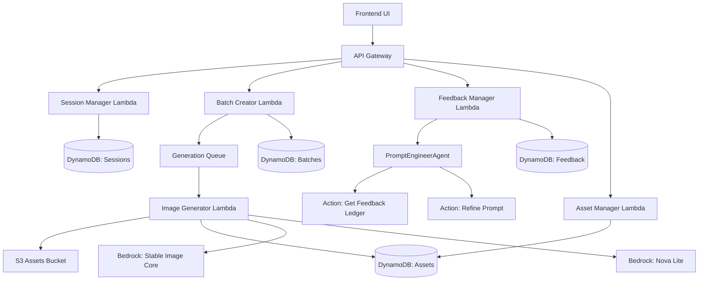
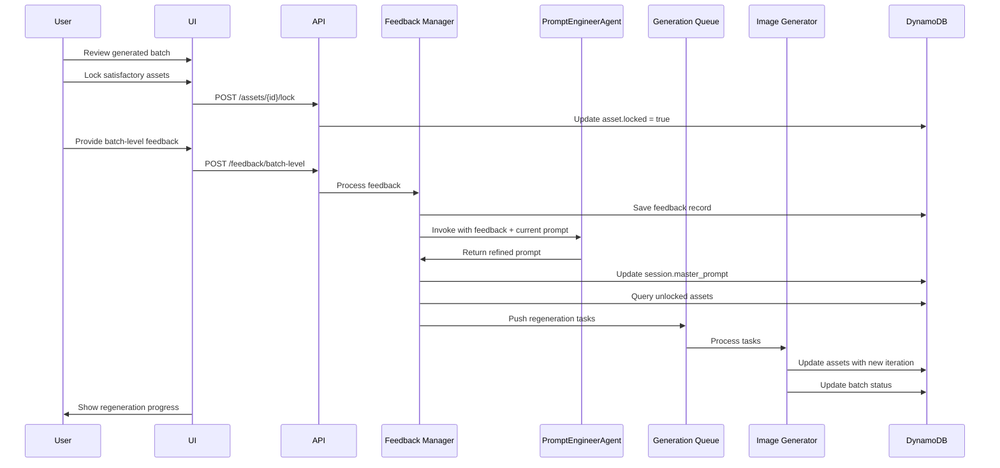
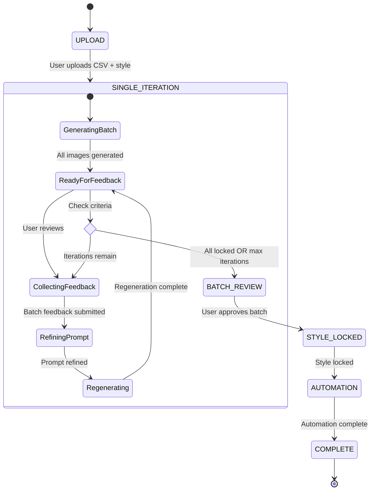

# Design Document: Iterative Batch Refinement Workflow

## Overview

The Iterative Batch Refinement Workflow transforms AssetQL from a single-test-image system into a full CSV-driven batch generation platform with per-image feedback, selective locking, and iterative regeneration capabilities. This feature enables users to refine entire batches (100-500+ assets) through multiple iteration cycles, approving individual images while regenerating only unsatisfactory ones until the complete batch meets quality standards.

### Key Capabilities

- Full CSV batch generation during SINGLE_ITERATION phase (not just test images)
- Per-image feedback mechanism for targeted refinement
- Image locking/approval system to preserve satisfactory assets
- Batch-level feedback for master prompt refinement via PromptEngineerAgent
- Selective regeneration that only processes unlocked assets
- Iteration tracking with configurable max iterations (default: 3)
- Strict phase transition criteria to BATCH_REVIEW phase
- Cost optimization through selective regeneration (avoiding redundant generation)

### Design Principles

1. **Selective Processing**: Only regenerate unlocked assets to minimize AI generation costs
2. **Iteration Tracking**: Maintain complete history of asset evolution across iterations
3. **CSV Fidelity**: Preserve CSV metadata associations across all iterations
4. **Workflow Orchestration**: Enforce strict phase transitions with clear eligibility criteria
5. **Error Resilience**: Handle partial failures gracefully without blocking batch progress
6. **Audit Trail**: Track all feedback, refinements, and regenerations for analytics


## Architecture

### System Components



### Component Responsibilities

**Session Manager Lambda** (`session-manager`)
- Manages session lifecycle and phase transitions
- Enforces legal phase transitions (SINGLE_ITERATION → BATCH_REVIEW)
- Stores master prompt and prompt history
- Tracks current iteration and max iterations

**Batch Creator Lambda** (`batch-creator`)
- Generates tasks for all CSV rows (not just test subset)
- Associates CSV metadata with each task
- Pushes tasks to Generation Queue in batches of 10
- Initializes batch with iteration tracking

**Feedback Manager Lambda** (`feedback-manager`) - NEW
- Handles per-image and batch-level feedback submission
- Invokes PromptEngineerAgent for batch-level feedback
- Triggers selective regeneration after prompt refinement
- Stores feedback records with type classification

**Asset Manager Lambda** (`asset-manager`) - NEW
- Handles asset locking/unlocking operations
- Queries assets by batch with locked status filtering
- Provides iteration status and transition eligibility
- Calculates locked asset percentage

**Image Generator Lambda** (`image-generator`)
- Extended to track iteration numbers
- Maintains iteration history for regenerated assets
- Preserves CSV metadata across iterations
- Updates batch progress counters

**PromptEngineerAgent** (Bedrock Agent)
- Refines master prompt based on batch-level feedback
- Considers per-image feedback for unlocked assets
- Preserves locked style elements from style profile
- Returns refined prompt with updated locked elements


## Data Models

### DynamoDB Schema Extensions

#### AssetQL-assets Table (Extended)

```javascript
{
  assetId: string,              // Partition key (existing)
  batchId: string,              // GSI partition key (existing)
  userId: string,               // (existing)
  s3Key: string,                // Current image URL (existing)
  styleProfileId: string,       // (existing)
  status: string,               // (existing)
  
  // NEW FIELDS for iteration workflow
  locked: boolean,              // Default: false
  locked_at_iteration: number,  // Iteration when locked (null if not locked)
  current_iteration: number,    // Current iteration number (starts at 1)
  iteration_history: [          // Array of previous iterations
    {
      iteration: number,
      s3Key: string,
      generatedAt: timestamp
    }
  ],
  
  // CSV metadata association
  csv_row_index: number,        // Index in original CSV (0-based)
  csv_metadata: {               // All CSV column values
    [columnName]: string
  },
  display_name: string,         // Extracted from CSV "name" or "item" column
  
  createdAt: timestamp,         // (existing)
  updatedAt: timestamp          // (existing)
}
```

**New GSI**: `batchId-locked-index`
- Partition key: `batchId`
- Sort key: `locked`
- Purpose: Efficiently query unlocked assets for selective regeneration

#### AssetQL-sessions Table (Extended)

```javascript
{
  sessionId: string,            // Partition key (existing)
  userId: string,               // GSI partition key (existing)
  name: string,                 // (existing)
  batchId: string,              // (existing)
  currentPhase: string,         // (existing)
  
  // NEW FIELDS for iteration workflow
  current_iteration: number,    // Current iteration (starts at 1)
  max_iterations: number,       // Default: 3
  master_prompt: string,        // Current master prompt template
  prompt_history: [             // Array of prompt refinements
    {
      iteration: number,
      prompt: string,
      refinedAt: timestamp,
      feedback: string          // Batch-level feedback that triggered refinement
    }
  ],
  
  lockedStyleElements: [],      // (existing)
  activeRefinements: [],        // (existing)
  createdAt: timestamp,         // (existing)
  updatedAt: timestamp          // (existing)
}
```

#### AssetQL-batches Table (Extended)

```javascript
{
  batchId: string,              // Partition key (existing)
  userId: string,               // (existing)
  name: string,                 // (existing)
  status: string,               // Extended: "queued", "generating", "ready_for_feedback", "completed"
  totalTasks: number,           // (existing)
  completedTasks: number,       // (existing)
  failedTasks: number,          // (existing)
  
  // NEW FIELDS for iteration workflow
  current_iteration: number,    // Current batch iteration
  locked_count: number,         // Number of locked assets
  total_count: number,          // Total assets (same as totalTasks)
  
  styleProfileId: string,       // (existing)
  config: {},                   // (existing)
  phase: string,                // (existing)
  template: string,             // (existing)
  createdAt: timestamp,         // (existing)
  updatedAt: timestamp          // (existing)
}
```

#### AssetQL-feedback Table (Extended)

```javascript
{
  feedbackId: string,           // Partition key (auto-generated UUID)
  sessionId: string,            // GSI partition key (existing)
  batchId: string,              // (existing)
  iterationNumber: number,      // GSI sort key (existing)
  
  // NEW FIELDS for feedback classification
  type: string,                 // "per_image" or "batch_level"
  assetId: string,              // Optional: only for per_image feedback
  
  feedbackText: string,         // (existing)
  timestamp: timestamp,         // (existing)
  userId: string                // (existing)
}
```

**New GSI**: `type-sessionId-iterationNumber-index`
- Partition key: `type`
- Sort key: `sessionId-iterationNumber` (composite)
- Purpose: Efficiently query feedback by type for agent invocation


## Components and Interfaces

### API Endpoints

#### 1. Feedback Manager API

**POST /api/v1/feedback/per-image**
```javascript
Request:
{
  assetId: string,
  feedbackText: string,
  sessionId: string,
  batchId: string,
  iterationNumber: number
}

Response: 201 Created
{
  feedbackId: string,
  message: "Per-image feedback saved successfully"
}
```

**POST /api/v1/feedback/batch-level**
```javascript
Request:
{
  sessionId: string,
  batchId: string,
  feedbackText: string,
  iterationNumber: number
}

Response: 200 OK
{
  feedbackId: string,
  refinedPrompt: string,
  regenerationTriggered: boolean,
  unlockedAssetsCount: number,
  message: "Batch-level feedback processed and regeneration initiated"
}

// Workflow:
// 1. Save feedback to DynamoDB with type="batch_level"
// 2. Invoke PromptEngineerAgent with feedback
// 3. Update session.master_prompt and append to prompt_history
// 4. Trigger selective regeneration for unlocked assets
```

#### 2. Asset Manager API

**POST /api/v1/assets/{assetId}/lock**
```javascript
Request: (empty body)

Response: 200 OK
{
  assetId: string,
  locked: true,
  locked_at_iteration: number,
  message: "Asset locked successfully"
}

Error: 400 Bad Request (if asset status is "regeneration_failed")
{
  error: "Cannot lock asset with failed generation status"
}
```

**POST /api/v1/assets/{assetId}/unlock**
```javascript
Request: (empty body)

Response: 200 OK
{
  assetId: string,
  locked: false,
  locked_at_iteration: null,
  message: "Asset unlocked successfully"
}
```

**GET /api/v1/batches/{batchId}/assets**
```javascript
Query Parameters:
- locked: boolean (optional filter)
- iteration: number (optional filter)

Response: 200 OK
{
  assets: [
    {
      assetId: string,
      s3Key: string,
      display_name: string,
      csv_metadata: {},
      locked: boolean,
      locked_at_iteration: number,
      current_iteration: number,
      iteration_history: [],
      status: string
    }
  ],
  total: number,
  locked_count: number,
  unlocked_count: number
}
```

**GET /api/v1/sessions/{sessionId}/iteration-status**
```javascript
Response: 200 OK
{
  sessionId: string,
  current_iteration: number,
  max_iterations: number,
  locked_count: number,
  total_count: number,
  locked_percentage: number,
  can_transition_to_batch_review: boolean,
  transition_criteria: {
    all_locked: boolean,
    max_iterations_reached: boolean,
    manual_override_available: boolean
  },
  message: string  // e.g., "3 of 10 assets locked. 2 iterations remaining."
}
```

**POST /api/v1/batches/{batchId}/regenerate**
```javascript
Request: (empty body or optional config overrides)

Response: 202 Accepted
{
  batchId: string,
  regeneration_id: string,
  unlocked_assets_count: number,
  estimated_completion_time: string,
  message: "Selective regeneration initiated for unlocked assets"
}

Error: 429 Too Many Requests (if queue is full)
{
  error: "Generation queue is at capacity. Please retry in a few minutes."
}
```


#### 3. Session Manager API (Extended)

**PUT /api/v1/sessions/{sessionId}/phase**
```javascript
Request:
{
  newPhase: string  // "BATCH_REVIEW"
}

Response: 200 OK (if transition is legal)
{
  sessionId: string,
  currentPhase: string,
  previousPhase: string,
  updatedAt: timestamp
}

Response: 409 Conflict (if transition is illegal)
{
  error: "Illegal phase transition",
  message: "Cannot transition from SINGLE_ITERATION to BATCH_REVIEW. Criteria not met.",
  currentPhase: string,
  attemptedPhase: string,
  allowedPhase: string,
  transition_criteria: {
    all_locked: boolean,
    max_iterations_reached: boolean,
    locked_percentage: number,
    minimum_locked_percentage: 80
  }
}

// Validation Logic:
// - Allow if all assets are locked
// - Allow if current_iteration >= max_iterations
// - Allow if user explicitly overrides (with warning if < 80% locked)
// - Prevent if unlocked assets exist AND iterations remain AND no override
```

#### 4. Batch Creator API (Extended)

**POST /api/v1/batches**
```javascript
Request:
{
  sessionId: string,           // NEW: Link batch to session
  styleProfileId: string,
  csvRows: [                   // Full CSV data (not just test subset)
    { name: "Item 1", color: "red", ... },
    { name: "Item 2", color: "blue", ... }
  ],
  template: string,            // Optional: auto-generated if not provided
  config: {
    width: number,
    height: number,
    steps: number,
    cfgScale: number
  },
  batchName: string,
  phase: "full"                // NEW: "full" instead of "test"
}

Response: 201 Created
{
  batchId: string,
  sessionId: string,
  totalTasks: number,          // All CSV rows
  phase: "full",
  template: string,
  message: "Full batch created with all CSV rows"
}

// Behavior Change:
// - When phase="full", process ALL csvRows (not 10% subset)
// - Initialize batch.current_iteration = 1
// - Initialize batch.locked_count = 0
// - Initialize batch.total_count = csvRows.length
// - Update session.batchId to link session to batch
```

### Lambda Function Implementations

#### Feedback Manager Lambda (NEW)

**File**: `lambdas/feedback-manager/index.js`

**Responsibilities**:
1. Handle per-image and batch-level feedback submission
2. Invoke PromptEngineerAgent for batch-level feedback
3. Trigger selective regeneration after prompt refinement
4. Store feedback records with proper type classification

**Key Functions**:

```javascript
// Handler routes requests based on path
exports.handler = async (event) => {
  const path = event.path;
  
  if (path.includes('/per-image')) {
    return await handlePerImageFeedback(event);
  } else if (path.includes('/batch-level')) {
    return await handleBatchLevelFeedback(event);
  }
};

// Store per-image feedback
async function handlePerImageFeedback(event) {
  const { assetId, feedbackText, sessionId, batchId, iterationNumber } = JSON.parse(event.body);
  
  const feedbackId = crypto.randomUUID();
  await dynamo.send(new PutCommand({
    TableName: process.env.FEEDBACK_TABLE_NAME,
    Item: {
      feedbackId,
      sessionId,
      batchId,
      iterationNumber,
      type: 'per_image',
      assetId,
      feedbackText,
      timestamp: Date.now(),
      userId: event.requestContext.authorizer.claims.sub
    }
  }));
  
  return response(201, { feedbackId, message: 'Per-image feedback saved' });
}

// Process batch-level feedback with agent invocation
async function handleBatchLevelFeedback(event) {
  const { sessionId, batchId, feedbackText, iterationNumber } = JSON.parse(event.body);
  
  // 1. Save feedback
  const feedbackId = crypto.randomUUID();
  await dynamo.send(new PutCommand({
    TableName: process.env.FEEDBACK_TABLE_NAME,
    Item: {
      feedbackId,
      sessionId,
      batchId,
      iterationNumber,
      type: 'batch_level',
      feedbackText,
      timestamp: Date.now(),
      userId: event.requestContext.authorizer.claims.sub
    }
  }));
  
  // 2. Fetch session to get current master prompt
  const sessionRes = await dynamo.send(new GetCommand({
    TableName: process.env.SESSIONS_TABLE_NAME,
    Key: { sessionId }
  }));
  const session = sessionRes.Item;
  
  // 3. Invoke PromptEngineerAgent with retry logic
  let refinedPrompt;
  try {
    refinedPrompt = await invokePromptEngineerAgent(
      sessionId,
      session.master_prompt,
      feedbackText,
      session.lockedStyleElements
    );
  } catch (error) {
    console.error('PromptEngineerAgent failed:', error);
    return response(500, {
      error: 'Prompt refinement failed',
      message: 'Current master prompt preserved. Please try again.',
      currentPrompt: session.master_prompt
    });
  }
  
  // 4. Update session with refined prompt
  await dynamo.send(new UpdateCommand({
    TableName: process.env.SESSIONS_TABLE_NAME,
    Key: { sessionId },
    UpdateExpression: 'SET master_prompt = :prompt, prompt_history = list_append(if_not_exists(prompt_history, :empty), :history)',
    ExpressionAttributeValues: {
      ':prompt': refinedPrompt,
      ':empty': [],
      ':history': [{
        iteration: iterationNumber,
        prompt: refinedPrompt,
        refinedAt: Date.now(),
        feedback: feedbackText
      }]
    }
  }));
  
  // 5. Trigger selective regeneration
  const unlockedCount = await triggerSelectiveRegeneration(batchId, sessionId, refinedPrompt);
  
  return response(200, {
    feedbackId,
    refinedPrompt,
    regenerationTriggered: true,
    unlockedAssetsCount: unlockedCount,
    message: 'Batch-level feedback processed and regeneration initiated'
  });
}

// Invoke PromptEngineerAgent with exponential backoff retry
async function invokePromptEngineerAgent(sessionId, currentPrompt, feedback, lockedElements) {
  const maxRetries = 3;
  let lastError;
  
  for (let attempt = 0; attempt < maxRetries; attempt++) {
    try {
      const agentResponse = await bedrockAgentRuntime.send(new InvokeAgentCommand({
        agentId: process.env.PROMPT_ENGINEER_AGENT_ID,
        agentAliasId: process.env.PROMPT_ENGINEER_AGENT_ALIAS_ID,
        sessionId: sessionId,
        inputText: `Refine this prompt based on feedback: "${feedback}". Current prompt: "${currentPrompt}". Preserve these locked elements: ${JSON.stringify(lockedElements)}`
      }));
      
      // Parse agent response to extract refined prompt
      const refinedPrompt = parseAgentResponse(agentResponse);
      return refinedPrompt;
      
    } catch (error) {
      lastError = error;
      if (attempt < maxRetries - 1) {
        const delay = Math.pow(2, attempt) * 1000; // 1s, 2s, 4s
        await new Promise(resolve => setTimeout(resolve, delay));
      }
    }
  }
  
  throw new Error(`PromptEngineerAgent failed after ${maxRetries} attempts: ${lastError.message}`);
}

// Trigger selective regeneration for unlocked assets
async function triggerSelectiveRegeneration(batchId, sessionId, refinedPrompt) {
  // Query unlocked assets using GSI
  const unlockedRes = await dynamo.send(new QueryCommand({
    TableName: process.env.ASSETS_TABLE_NAME,
    IndexName: 'batchId-locked-index',
    KeyConditionExpression: 'batchId = :batchId AND locked = :locked',
    ExpressionAttributeValues: {
      ':batchId': batchId,
      ':locked': false
    }
  }));
  
  const unlockedAssets = unlockedRes.Items || [];
  
  if (unlockedAssets.length === 0) {
    return 0;
  }
  
  // Fetch batch and session for config
  const batchRes = await dynamo.send(new GetCommand({
    TableName: process.env.BATCHES_TABLE_NAME,
    Key: { batchId }
  }));
  const batch = batchRes.Item;
  
  const sessionRes = await dynamo.send(new GetCommand({
    TableName: process.env.SESSIONS_TABLE_NAME,
    Key: { sessionId }
  }));
  const session = sessionRes.Item;
  
  const newIteration = session.current_iteration + 1;
  
  // Create regeneration tasks
  const tasks = unlockedAssets.map(asset => {
    // Apply refined prompt template with CSV metadata
    let prompt = refinedPrompt.replace(/\{(\w+)\}/g, (_, key) => asset.csv_metadata[key] || '');
    
    return {
      taskId: crypto.randomUUID(),
      assetId: asset.assetId,
      prompt,
      iteration: newIteration,
      csv_metadata: asset.csv_metadata
    };
  });
  
  // Push to SQS in batches of 10
  for (let i = 0; i < tasks.length; i += 10) {
    const chunk = tasks.slice(i, i + 10);
    
    await sqs.send(new SendMessageBatchCommand({
      QueueUrl: process.env.SQS_QUEUE_URL,
      Entries: chunk.map(task => ({
        Id: task.taskId,
        MessageBody: JSON.stringify({
          batchId,
          assetId: task.assetId,
          taskId: task.taskId,
          prompt: task.prompt,
          styleProfileId: batch.styleProfileId,
          config: batch.config,
          iteration: task.iteration,
          isRegeneration: true
        })
      }))
    }));
  }
  
  // Update batch status
  await dynamo.send(new UpdateCommand({
    TableName: process.env.BATCHES_TABLE_NAME,
    Key: { batchId },
    UpdateExpression: 'SET #status = :status, current_iteration = :iteration',
    ExpressionAttributeNames: { '#status': 'status' },
    ExpressionAttributeValues: {
      ':status': 'regenerating',
      ':iteration': newIteration
    }
  }));
  
  return unlockedAssets.length;
}
```


#### Asset Manager Lambda (NEW)

**File**: `lambdas/asset-manager/index.js`

**Responsibilities**:
1. Handle asset locking/unlocking operations
2. Query assets by batch with filtering
3. Calculate iteration status and transition eligibility
4. Validate asset state before operations

**Key Functions**:

```javascript
exports.handler = async (event) => {
  const path = event.path;
  const httpMethod = event.httpMethod;
  
  if (path.includes('/lock')) {
    return await lockAsset(event);
  } else if (path.includes('/unlock')) {
    return await unlockAsset(event);
  } else if (path.includes('/assets') && httpMethod === 'GET') {
    return await getAssetsByBatch(event);
  } else if (path.includes('/iteration-status')) {
    return await getIterationStatus(event);
  }
};

async function lockAsset(event) {
  const { assetId } = event.pathParameters;
  const userId = event.requestContext.authorizer.claims.sub;
  
  // Fetch asset
  const assetRes = await dynamo.send(new GetCommand({
    TableName: process.env.ASSETS_TABLE_NAME,
    Key: { assetId }
  }));
  
  if (!assetRes.Item) {
    return response(404, { error: 'Asset not found' });
  }
  
  const asset = assetRes.Item;
  
  // Validate asset status
  if (asset.status === 'regeneration_failed') {
    return response(400, {
      error: 'Cannot lock asset with failed generation status',
      assetId,
      status: asset.status
    });
  }
  
  // Fetch session to get current iteration
  const batchRes = await dynamo.send(new GetCommand({
    TableName: process.env.BATCHES_TABLE_NAME,
    Key: { batchId: asset.batchId }
  }));
  const currentIteration = batchRes.Item.current_iteration;
  
  // Lock asset
  await dynamo.send(new UpdateCommand({
    TableName: process.env.ASSETS_TABLE_NAME,
    Key: { assetId },
    UpdateExpression: 'SET locked = :locked, locked_at_iteration = :iteration',
    ExpressionAttributeValues: {
      ':locked': true,
      ':iteration': currentIteration
    }
  }));
  
  // Increment batch locked_count
  await dynamo.send(new UpdateCommand({
    TableName: process.env.BATCHES_TABLE_NAME,
    Key: { batchId: asset.batchId },
    UpdateExpression: 'SET locked_count = locked_count + :inc',
    ExpressionAttributeValues: { ':inc': 1 }
  }));
  
  return response(200, {
    assetId,
    locked: true,
    locked_at_iteration: currentIteration,
    message: 'Asset locked successfully'
  });
}

async function unlockAsset(event) {
  const { assetId } = event.pathParameters;
  
  // Fetch asset
  const assetRes = await dynamo.send(new GetCommand({
    TableName: process.env.ASSETS_TABLE_NAME,
    Key: { assetId }
  }));
  
  if (!assetRes.Item) {
    return response(404, { error: 'Asset not found' });
  }
  
  const asset = assetRes.Item;
  
  // Unlock asset
  await dynamo.send(new UpdateCommand({
    TableName: process.env.ASSETS_TABLE_NAME,
    Key: { assetId },
    UpdateExpression: 'SET locked = :locked, locked_at_iteration = :null',
    ExpressionAttributeValues: {
      ':locked': false,
      ':null': null
    }
  }));
  
  // Decrement batch locked_count (only if was previously locked)
  if (asset.locked) {
    await dynamo.send(new UpdateCommand({
      TableName: process.env.BATCHES_TABLE_NAME,
      Key: { batchId: asset.batchId },
      UpdateExpression: 'SET locked_count = locked_count - :dec',
      ExpressionAttributeValues: { ':dec': 1 }
    }));
  }
  
  return response(200, {
    assetId,
    locked: false,
    locked_at_iteration: null,
    message: 'Asset unlocked successfully'
  });
}

async function getAssetsByBatch(event) {
  const { batchId } = event.pathParameters;
  const queryParams = event.queryStringParameters || {};
  
  // Query all assets for batch
  const assetsRes = await dynamo.send(new QueryCommand({
    TableName: process.env.ASSETS_TABLE_NAME,
    IndexName: 'batchId-index',
    KeyConditionExpression: 'batchId = :batchId',
    ExpressionAttributeValues: { ':batchId': batchId }
  }));
  
  let assets = assetsRes.Items || [];
  
  // Apply filters
  if (queryParams.locked !== undefined) {
    const lockedFilter = queryParams.locked === 'true';
    assets = assets.filter(a => a.locked === lockedFilter);
  }
  
  if (queryParams.iteration !== undefined) {
    const iterationFilter = parseInt(queryParams.iteration);
    assets = assets.filter(a => a.current_iteration === iterationFilter);
  }
  
  // Calculate counts
  const lockedCount = assets.filter(a => a.locked).length;
  const unlockedCount = assets.length - lockedCount;
  
  return response(200, {
    assets,
    total: assets.length,
    locked_count: lockedCount,
    unlocked_count: unlockedCount
  });
}

async function getIterationStatus(event) {
  const { sessionId } = event.pathParameters;
  
  // Fetch session
  const sessionRes = await dynamo.send(new GetCommand({
    TableName: process.env.SESSIONS_TABLE_NAME,
    Key: { sessionId }
  }));
  
  if (!sessionRes.Item) {
    return response(404, { error: 'Session not found' });
  }
  
  const session = sessionRes.Item;
  
  // Fetch batch
  const batchRes = await dynamo.send(new GetCommand({
    TableName: process.env.BATCHES_TABLE_NAME,
    Key: { batchId: session.batchId }
  }));
  
  if (!batchRes.Item) {
    return response(404, { error: 'Batch not found for session' });
  }
  
  const batch = batchRes.Item;
  
  // Calculate transition eligibility
  const allLocked = batch.locked_count === batch.total_count;
  const maxIterationsReached = session.current_iteration >= session.max_iterations;
  const lockedPercentage = (batch.locked_count / batch.total_count) * 100;
  
  const canTransition = allLocked || maxIterationsReached;
  
  let message;
  if (allLocked) {
    message = `All ${batch.total_count} assets locked. Ready for Batch Review.`;
  } else if (maxIterationsReached) {
    message = `Max iterations (${session.max_iterations}) reached. ${batch.locked_count} of ${batch.total_count} assets locked.`;
  } else {
    const remaining = session.max_iterations - session.current_iteration;
    message = `${batch.locked_count} of ${batch.total_count} assets locked. ${remaining} iteration(s) remaining.`;
  }
  
  return response(200, {
    sessionId,
    current_iteration: session.current_iteration,
    max_iterations: session.max_iterations,
    locked_count: batch.locked_count,
    total_count: batch.total_count,
    locked_percentage: lockedPercentage,
    can_transition_to_batch_review: canTransition,
    transition_criteria: {
      all_locked: allLocked,
      max_iterations_reached: maxIterationsReached,
      manual_override_available: true
    },
    message
  });
}
```


#### Image Generator Lambda (Extended)

**File**: `lambdas/image-generator/index.js`

**Changes Required**:

```javascript
// Extended message format from SQS
const message = {
  batchId: string,
  assetId: string,        // NEW: for regeneration
  taskId: string,
  prompt: string,
  styleProfileId: string,
  config: {},
  iteration: number,      // NEW: iteration number
  isRegeneration: boolean // NEW: flag for regeneration vs initial generation
};

exports.handler = async (event) => {
  const record = event.Records[0];
  const { batchId, assetId, taskId, prompt, styleProfileId, config, iteration, isRegeneration } = JSON.parse(record.body);
  
  let currentAsset = null;
  
  // If regeneration, fetch existing asset to preserve history
  if (isRegeneration && assetId) {
    const assetRes = await dynamo.send(new GetCommand({
      TableName: process.env.ASSETS_TABLE_NAME,
      Key: { assetId }
    }));
    currentAsset = assetRes.Item;
  }
  
  try {
    // Generate image with Stable Image Core
    const imageBuffer = await generateImage(prompt, config);
    
    // Score style consistency with Nova Lite
    const styleScore = await scoreStyleConsistency(imageBuffer, styleProfileId);
    
    // Retry logic if style score is below threshold
    if (styleScore < 85 && retryCount < 3) {
      // ... existing retry logic
    }
    
    // Save to S3
    const s3Key = `raw/${batchId}/${assetId || crypto.randomUUID()}.png`;
    await s3.send(new PutObjectCommand({
      Bucket: process.env.S3_BUCKET,
      Key: s3Key,
      Body: imageBuffer,
      ContentType: 'image/png'
    }));
    
    if (isRegeneration && currentAsset) {
      // Update existing asset with new iteration
      await dynamo.send(new UpdateCommand({
        TableName: process.env.ASSETS_TABLE_NAME,
        Key: { assetId },
        UpdateExpression: 'SET s3Key = :s3Key, current_iteration = :iteration, iteration_history = list_append(if_not_exists(iteration_history, :empty), :history), #status = :status, updatedAt = :updated',
        ExpressionAttributeNames: { '#status': 'status' },
        ExpressionAttributeValues: {
          ':s3Key': s3Key,
          ':iteration': iteration,
          ':empty': [],
          ':history': [{
            iteration: currentAsset.current_iteration,
            s3Key: currentAsset.s3Key,
            generatedAt: currentAsset.updatedAt
          }],
          ':status': 'completed',
          ':updated': Date.now()
        }
      }));
    } else {
      // Create new asset record (initial generation)
      const newAssetId = assetId || crypto.randomUUID();
      
      // Extract display_name from CSV metadata
      const csvMetadata = JSON.parse(record.body).csv_metadata || {};
      const displayName = csvMetadata.name || csvMetadata.item || csvMetadata.product || newAssetId;
      
      await dynamo.send(new PutCommand({
        TableName: process.env.ASSETS_TABLE_NAME,
        Item: {
          assetId: newAssetId,
          batchId,
          userId: batch.userId,
          s3Key,
          styleProfileId,
          status: 'completed',
          locked: false,
          locked_at_iteration: null,
          current_iteration: iteration || 1,
          iteration_history: [],
          csv_row_index: JSON.parse(record.body).csv_row_index,
          csv_metadata: csvMetadata,
          display_name: displayName,
          createdAt: Date.now(),
          updatedAt: Date.now()
        }
      }));
    }
    
    // Update batch progress
    await dynamo.send(new UpdateCommand({
      TableName: process.env.BATCHES_TABLE_NAME,
      Key: { batchId },
      UpdateExpression: 'SET completedTasks = completedTasks + :inc',
      ExpressionAttributeValues: { ':inc': 1 }
    }));
    
    // Check if batch is complete
    const batchRes = await dynamo.send(new GetCommand({
      TableName: process.env.BATCHES_TABLE_NAME,
      Key: { batchId }
    }));
    const batch = batchRes.Item;
    
    if (batch.completedTasks === batch.totalTasks) {
      await dynamo.send(new UpdateCommand({
        TableName: process.env.BATCHES_TABLE_NAME,
        Key: { batchId },
        UpdateExpression: 'SET #status = :status',
        ExpressionAttributeNames: { '#status': 'status' },
        ExpressionAttributeValues: { ':status': 'ready_for_feedback' }
      }));
    }
    
  } catch (error) {
    console.error('Image generation failed:', error);
    
    // Mark asset as failed
    if (isRegeneration && assetId) {
      await dynamo.send(new UpdateCommand({
        TableName: process.env.ASSETS_TABLE_NAME,
        Key: { assetId },
        UpdateExpression: 'SET #status = :status',
        ExpressionAttributeNames: { '#status': 'status' },
        ExpressionAttributeValues: { ':status': 'regeneration_failed' }
      }));
    }
    
    // Update batch failed count
    await dynamo.send(new UpdateCommand({
      TableName: process.env.BATCHES_TABLE_NAME,
      Key: { batchId },
      UpdateExpression: 'SET failedTasks = failedTasks + :inc',
      ExpressionAttributeValues: { ':inc': 1 }
    }));
  }
};
```


#### Batch Creator Lambda (Extended)

**File**: `lambdas/batch-creator/index.js`

**Changes Required**:

```javascript
async function createBatch(event) {
  const userId = event.requestContext.authorizer.claims.sub;
  const { sessionId, styleProfileId, csvRows, template, config, batchName, phase = 'full' } = JSON.parse(event.body);
  
  // NEW: Require sessionId for linking
  if (!sessionId) {
    return response(400, { error: 'sessionId is required' });
  }
  
  const batchId = crypto.randomUUID();
  
  // NEW: Process ALL rows for full batch (no 10% subset)
  const rowsToProcess = csvRows;
  const totalTasks = rowsToProcess.length;
  
  // Auto-generate template if not provided
  let finalTemplate = template;
  if (!finalTemplate) {
    const columns = Object.keys(csvRows[0]);
    finalTemplate = generateSmartTemplate(columns);
  }
  
  // Fetch style profile
  const styleRes = await dynamo.send(new GetCommand({
    TableName: process.env.STYLES_TABLE_NAME,
    Key: { styleProfileId }
  }));
  const style = styleRes.Item;
  if (!style) return response(404, { error: 'Style profile not found' });
  
  // Create tasks with CSV metadata
  const tasks = rowsToProcess.map((row, index) => {
    let prompt = finalTemplate.replace(/\{(\w+)\}/g, (_, key) => row[key] || '');
    prompt += `, ${style.descriptors?.artStyle || ''}, ${style.descriptors?.mood || ''} atmosphere`;
    prompt += `, colors: ${(style.descriptors?.colorPalette || []).join(', ')}`;
    
    return {
      taskId: crypto.randomUUID(),
      prompt,
      csv_row_index: index,
      csv_metadata: row
    };
  });
  
  // Create batch record with iteration tracking
  const batchItem = {
    batchId,
    userId,
    name: batchName,
    status: 'queued',
    totalTasks,
    completedTasks: 0,
    failedTasks: 0,
    styleProfileId,
    config,
    phase,
    template: finalTemplate,
    current_iteration: 1,        // NEW
    locked_count: 0,             // NEW
    total_count: totalTasks,     // NEW
    createdAt: Date.now()
  };
  
  await dynamo.send(new PutCommand({
    TableName: process.env.BATCHES_TABLE_NAME,
    Item: batchItem
  }));
  
  // Update session with batchId and master_prompt
  await dynamo.send(new UpdateCommand({
    TableName: process.env.SESSIONS_TABLE_NAME,
    Key: { sessionId },
    UpdateExpression: 'SET batchId = :batchId, master_prompt = :prompt, current_iteration = :iteration',
    ExpressionAttributeValues: {
      ':batchId': batchId,
      ':prompt': finalTemplate,
      ':iteration': 1
    }
  }));
  
  // Insert task records and push to SQS
  for (let i = 0; i < tasks.length; i += 10) {
    const chunk = tasks.slice(i, i + 10);
    
    await Promise.all(chunk.map(task => dynamo.send(new PutCommand({
      TableName: process.env.TASKS_TABLE_NAME,
      Item: {
        taskId: task.taskId,
        batchId,
        status: 'queued',
        prompt: task.prompt,
        csv_row_index: task.csv_row_index,
        csv_metadata: task.csv_metadata,
        retryCount: 0,
        createdAt: Date.now()
      }
    }))));
    
    await sqs.send(new SendMessageBatchCommand({
      QueueUrl: process.env.SQS_QUEUE_URL,
      Entries: chunk.map(task => ({
        Id: task.taskId,
        MessageBody: JSON.stringify({
          batchId,
          taskId: task.taskId,
          prompt: task.prompt,
          styleProfileId,
          config,
          iteration: 1,
          isRegeneration: false,
          csv_row_index: task.csv_row_index,
          csv_metadata: task.csv_metadata
        })
      }))
    }));
  }
  
  return response(201, {
    batchId,
    sessionId,
    totalTasks,
    phase,
    template: finalTemplate,
    message: 'Full batch created with all CSV rows'
  });
}
```


#### Session Manager Lambda (Extended)

**File**: `lambdas/session-manager/index.js`

**Changes Required**:

```javascript
// Extended session creation with iteration fields
async function createSession(event) {
  const body = JSON.parse(event.body);
  const userId = event.requestContext.authorizer.claims.sub;
  const name = body.name || 'Untitled Session';
  const batchId = body.batchId || null;
  
  const sessionId = crypto.randomUUID();
  
  const sessionItem = {
    sessionId,
    userId,
    name,
    batchId,
    currentPhase: 'UPLOAD',
    masterPrompt: '',
    lockedStyleElements: [],
    activeRefinements: [],
    current_iteration: 1,        // NEW
    max_iterations: 3,           // NEW
    prompt_history: [],          // NEW
    createdAt: new Date().toISOString(),
    updatedAt: new Date().toISOString()
  };
  
  await dynamo.send(new PutCommand({
    TableName: process.env.SESSIONS_TABLE_NAME,
    Item: sessionItem
  }));
  
  return response(201, {
    sessionId,
    userId,
    name,
    currentPhase: 'UPLOAD',
    createdAt: sessionItem.createdAt
  });
}

// Extended phase transition validation
async function updateSessionPhase(event) {
  const sessionId = event.pathParameters.sessionId;
  const body = JSON.parse(event.body || '{}');
  const newPhase = body.newPhase;
  
  if (!newPhase) {
    return response(400, { error: 'newPhase is required' });
  }
  
  // Fetch session
  const sessionRes = await dynamo.send(new GetCommand({
    TableName: process.env.SESSIONS_TABLE_NAME,
    Key: { sessionId }
  }));
  
  if (!sessionRes.Item) {
    return response(404, { error: 'Session not found' });
  }
  
  const session = sessionRes.Item;
  const currentPhase = session.currentPhase;
  
  // Validate legal transition
  const allowedNextPhase = LEGAL_TRANSITIONS[currentPhase];
  
  if (allowedNextPhase !== newPhase) {
    return response(409, {
      error: 'Illegal phase transition',
      message: `Cannot transition from ${currentPhase} to ${newPhase}`,
      currentPhase,
      attemptedPhase: newPhase,
      allowedPhase: allowedNextPhase
    });
  }
  
  // NEW: Additional validation for SINGLE_ITERATION → BATCH_REVIEW
  if (currentPhase === 'SINGLE_ITERATION' && newPhase === 'BATCH_REVIEW') {
    // Fetch batch to check transition criteria
    const batchRes = await dynamo.send(new GetCommand({
      TableName: process.env.BATCHES_TABLE_NAME,
      Key: { batchId: session.batchId }
    }));
    
    if (!batchRes.Item) {
      return response(400, { error: 'Batch not found for session' });
    }
    
    const batch = batchRes.Item;
    const allLocked = batch.locked_count === batch.total_count;
    const maxIterationsReached = session.current_iteration >= session.max_iterations;
    const lockedPercentage = (batch.locked_count / batch.total_count) * 100;
    
    // Allow transition if criteria met OR user explicitly overrides
    const canTransition = allLocked || maxIterationsReached || body.forceTransition === true;
    
    if (!canTransition) {
      return response(409, {
        error: 'Transition criteria not met',
        message: 'Cannot transition to BATCH_REVIEW. Not all assets are locked and iterations remain.',
        currentPhase,
        attemptedPhase: newPhase,
        transition_criteria: {
          all_locked: allLocked,
          max_iterations_reached: maxIterationsReached,
          locked_percentage: lockedPercentage,
          minimum_locked_percentage: 80
        },
        hint: 'Set forceTransition: true to override'
      });
    }
    
    // Warn if less than 80% locked
    if (lockedPercentage < 80 && !allLocked) {
      console.warn(`Session ${sessionId} transitioning to BATCH_REVIEW with only ${lockedPercentage}% locked`);
    }
  }
  
  // Perform transition
  await dynamo.send(new UpdateCommand({
    TableName: process.env.SESSIONS_TABLE_NAME,
    Key: { sessionId },
    UpdateExpression: 'SET currentPhase = :phase, updatedAt = :updated',
    ExpressionAttributeValues: {
      ':phase': newPhase,
      ':updated': new Date().toISOString()
    }
  }));
  
  // Fetch updated session
  const updatedRes = await dynamo.send(new GetCommand({
    TableName: process.env.SESSIONS_TABLE_NAME,
    Key: { sessionId }
  }));
  
  return response(200, updatedRes.Item);
}
```


## Workflow Orchestration

### Iteration Cycle Flow



### Phase Transition Logic



### Selective Regeneration Algorithm

```javascript
async function selectiveRegeneration(batchId, sessionId, refinedPrompt) {
  // 1. Query unlocked assets
  const unlocked = await queryUnlockedAssets(batchId);
  
  if (unlocked.length === 0) {
    return { message: 'No unlocked assets to regenerate', count: 0 };
  }
  
  // 2. Increment session iteration
  const session = await getSession(sessionId);
  const newIteration = session.current_iteration + 1;
  
  if (newIteration > session.max_iterations) {
    throw new Error('Max iterations reached');
  }
  
  await updateSessionIteration(sessionId, newIteration);
  
  // 3. Create regeneration tasks preserving CSV metadata
  const tasks = unlocked.map(asset => ({
    taskId: crypto.randomUUID(),
    assetId: asset.assetId,
    prompt: applyTemplate(refinedPrompt, asset.csv_metadata),
    iteration: newIteration,
    csv_metadata: asset.csv_metadata,
    csv_row_index: asset.csv_row_index
  }));
  
  // 4. Push to SQS in batches of 10
  await pushToQueue(tasks);
  
  // 5. Update batch status
  await updateBatchStatus(batchId, 'regenerating', newIteration);
  
  return { message: 'Regeneration initiated', count: unlocked.length };
}

async function queryUnlockedAssets(batchId) {
  return await dynamo.send(new QueryCommand({
    TableName: process.env.ASSETS_TABLE_NAME,
    IndexName: 'batchId-locked-index',
    KeyConditionExpression: 'batchId = :batchId AND locked = :locked',
    ExpressionAttributeValues: {
      ':batchId': batchId,
      ':locked': false
    }
  }));
}
```

### Iteration Termination Conditions

The system terminates iteration cycles when ANY of these conditions are met:

1. **All Assets Locked**: `batch.locked_count === batch.total_count`
2. **Max Iterations Reached**: `session.current_iteration >= session.max_iterations`
3. **User Manual Override**: User explicitly transitions to BATCH_REVIEW

**Transition Validation Logic**:

```javascript
function canTransitionToBatchReview(session, batch, forceTransition = false) {
  const allLocked = batch.locked_count === batch.total_count;
  const maxIterationsReached = session.current_iteration >= session.max_iterations;
  const lockedPercentage = (batch.locked_count / batch.total_count) * 100;
  
  // Allow if criteria met
  if (allLocked || maxIterationsReached) {
    return { allowed: true, warning: null };
  }
  
  // Allow with warning if user forces and >= 80% locked
  if (forceTransition && lockedPercentage >= 80) {
    return {
      allowed: true,
      warning: `Only ${lockedPercentage.toFixed(1)}% of assets are locked`
    };
  }
  
  // Allow with strong warning if user forces and < 80% locked
  if (forceTransition && lockedPercentage < 80) {
    return {
      allowed: true,
      warning: `WARNING: Only ${lockedPercentage.toFixed(1)}% of assets are locked. Recommended minimum is 80%.`
    };
  }
  
  // Prevent transition
  return {
    allowed: false,
    message: `Cannot transition. ${batch.locked_count} of ${batch.total_count} locked. ${session.max_iterations - session.current_iteration} iterations remaining.`
  };
}
```


## Error Handling

### Error Categories and Recovery Strategies

#### 1. PromptEngineerAgent Failures

**Scenario**: Agent invocation fails due to throttling, timeout, or model errors

**Handling**:
```javascript
async function invokeAgentWithRetry(sessionId, prompt, feedback, lockedElements) {
  const maxRetries = 3;
  const delays = [1000, 2000, 4000]; // Exponential backoff
  
  for (let attempt = 0; attempt < maxRetries; attempt++) {
    try {
      return await bedrockAgentRuntime.send(new InvokeAgentCommand({
        agentId: process.env.PROMPT_ENGINEER_AGENT_ID,
        agentAliasId: process.env.PROMPT_ENGINEER_AGENT_ALIAS_ID,
        sessionId,
        inputText: buildAgentPrompt(prompt, feedback, lockedElements)
      }));
    } catch (error) {
      console.error(`Agent invocation attempt ${attempt + 1} failed:`, error);
      
      if (attempt < maxRetries - 1) {
        await sleep(delays[attempt]);
      } else {
        // Final failure: preserve current prompt
        throw new Error(`PromptEngineerAgent failed after ${maxRetries} attempts: ${error.message}`);
      }
    }
  }
}

// Error response to user
{
  statusCode: 500,
  body: {
    error: 'Prompt refinement failed',
    message: 'Unable to refine prompt at this time. Your current master prompt has been preserved. Please try again.',
    currentPrompt: session.master_prompt,
    retryable: true
  }
}
```

#### 2. Partial Regeneration Failures

**Scenario**: Some assets fail to regenerate while others succeed

**Handling**:
```javascript
// In image-generator Lambda
try {
  // Generate image
  const imageBuffer = await generateImage(prompt, config);
  // ... save and update
} catch (error) {
  console.error(`Asset ${assetId} regeneration failed:`, error);
  
  // Mark asset as failed but don't block batch
  await dynamo.send(new UpdateCommand({
    TableName: process.env.ASSETS_TABLE_NAME,
    Key: { assetId },
    UpdateExpression: 'SET #status = :status, error_message = :error',
    ExpressionAttributeNames: { '#status': 'status' },
    ExpressionAttributeValues: {
      ':status': 'regeneration_failed',
      ':error': error.message
    }
  }));
  
  // Increment failed count
  await dynamo.send(new UpdateCommand({
    TableName: process.env.BATCHES_TABLE_NAME,
    Key: { batchId },
    UpdateExpression: 'SET failedTasks = failedTasks + :inc',
    ExpressionAttributeValues: { ':inc': 1 }
  }));
  
  // Continue processing other assets (don't throw)
}

// UI displays failed assets with retry option
{
  assetId: "abc-123",
  status: "regeneration_failed",
  error_message: "Style consistency score too low after 3 attempts",
  actions: ["retry", "unlock_and_skip"]
}
```

#### 3. Lock Operation on Failed Assets

**Scenario**: User attempts to lock an asset that failed generation

**Handling**:
```javascript
async function lockAsset(assetId) {
  const asset = await getAsset(assetId);
  
  if (asset.status === 'regeneration_failed') {
    return response(400, {
      error: 'Cannot lock failed asset',
      message: 'This asset failed generation. Please regenerate or skip it.',
      assetId,
      status: asset.status,
      error_message: asset.error_message,
      suggested_actions: ['regenerate', 'provide_feedback', 'skip']
    });
  }
  
  // Proceed with lock
  // ...
}
```

#### 4. Phase Transition with Failed Assets

**Scenario**: User attempts to transition to BATCH_REVIEW with failed assets

**Handling**:
```javascript
async function validateBatchReviewTransition(sessionId, batchId) {
  const assets = await getAssetsByBatch(batchId);
  const failedAssets = assets.filter(a => a.status === 'regeneration_failed');
  
  if (failedAssets.length > 0) {
    return {
      allowed: false,
      warning: `${failedAssets.length} asset(s) failed generation`,
      failed_assets: failedAssets.map(a => ({
        assetId: a.assetId,
        display_name: a.display_name,
        error: a.error_message
      })),
      suggested_actions: [
        'Regenerate failed assets',
        'Unlock and provide feedback',
        'Skip failed assets and proceed (not recommended)'
      ]
    };
  }
  
  return { allowed: true };
}
```

#### 5. SQS Queue Capacity

**Scenario**: Generation queue is at capacity

**Handling**:
```javascript
async function pushToQueue(tasks) {
  try {
    // Attempt to send messages
    await sqs.send(new SendMessageBatchCommand({
      QueueUrl: process.env.SQS_QUEUE_URL,
      Entries: tasks.map(t => ({
        Id: t.taskId,
        MessageBody: JSON.stringify(t)
      }))
    }));
  } catch (error) {
    if (error.name === 'OverLimit' || error.message.includes('queue is full')) {
      return response(429, {
        error: 'Generation queue at capacity',
        message: 'The system is currently processing a high volume of requests. Please retry in a few minutes.',
        retry_after: 300, // seconds
        current_queue_depth: await getQueueDepth()
      });
    }
    throw error;
  }
}
```

#### 6. CSV Metadata Corruption

**Scenario**: CSV metadata is missing or corrupted during regeneration

**Handling**:
```javascript
function validateCsvMetadata(asset) {
  if (!asset.csv_metadata || Object.keys(asset.csv_metadata).length === 0) {
    console.warn(`Asset ${asset.assetId} has missing CSV metadata`);
    
    // Fallback to display_name or assetId
    return {
      csv_metadata: { name: asset.display_name || asset.assetId },
      csv_row_index: asset.csv_row_index || 0,
      display_name: asset.display_name || asset.assetId
    };
  }
  
  return asset;
}

// Invariant check during regeneration
function preserveCsvMetadata(currentAsset, newData) {
  // CSV metadata should NEVER change during regeneration
  if (JSON.stringify(currentAsset.csv_metadata) !== JSON.stringify(newData.csv_metadata)) {
    throw new Error('CSV metadata corruption detected during regeneration');
  }
  
  return {
    ...newData,
    csv_metadata: currentAsset.csv_metadata,
    csv_row_index: currentAsset.csv_row_index,
    display_name: currentAsset.display_name
  };
}
```

### Error Monitoring and Alerts

**CloudWatch Metrics**:
- `PromptRefinementFailureRate`: Percentage of agent invocations that fail
- `RegenerationFailureRate`: Percentage of regenerations that fail
- `QueueCapacityUtilization`: SQS queue depth as percentage of max
- `PhaseTransitionRejectionRate`: Percentage of illegal transition attempts

**Alarms**:
- Alert if `PromptRefinementFailureRate > 10%` over 5 minutes
- Alert if `RegenerationFailureRate > 15%` over 10 minutes
- Alert if `QueueCapacityUtilization > 80%` over 5 minutes


## Correctness Properties

A property is a characteristic or behavior that should hold true across all valid executions of a system—essentially, a formal statement about what the system should do. Properties serve as the bridge between human-readable specifications and machine-verifiable correctness guarantees.

### Property 1: CSV Metadata Preservation Across Iterations

For any asset that undergoes regeneration, the CSV metadata (csv_row_index, csv_metadata, display_name) SHALL remain unchanged across all iterations.

**Validates: Requirements 2.4, 2.5, 6.5**

**Rationale**: CSV metadata links each asset to its source data and must be immutable. This is an invariant property—regeneration changes the image but never the metadata association.

### Property 2: Locked Asset Immutability

For any asset where locked = true, regeneration operations SHALL NOT modify the s3Key, and the asset SHALL NOT appear in selective regeneration queries.

**Validates: Requirements 6.6, 6.7**

**Rationale**: Locked assets represent user-approved images that must be preserved. This is a critical invariant for cost optimization and user trust.

### Property 3: Iteration Increment on Regeneration

For any asset that is regenerated, the current_iteration field SHALL increment by exactly 1, and the previous s3Key SHALL be appended to iteration_history.

**Validates: Requirements 6.3, 7.3, 7.4, 8.4**

**Rationale**: Iteration tracking must be monotonically increasing and maintain complete history for audit trails.

### Property 4: Asset Schema Compliance

For any asset record created or updated, the record SHALL include all required fields: locked (boolean), locked_at_iteration (number or null), current_iteration (number), iteration_history (array), csv_row_index (number), csv_metadata (object), display_name (string).

**Validates: Requirements 4.1, 4.2, 7.1, 7.2**

**Rationale**: Schema compliance ensures data integrity and prevents runtime errors from missing fields.

### Property 5: Selective Regeneration Correctness

For any batch-level feedback submission, the set of assets queued for regeneration SHALL equal the set of assets where locked = false, and SHALL NOT include any assets where locked = true.

**Validates: Requirements 6.1, 6.2**

**Rationale**: Selective regeneration is the core cost optimization mechanism and must be precisely correct.

### Property 6: Feedback Type Classification

For any feedback submission, the type field SHALL be "per_image" if assetId is provided, and "batch_level" if assetId is null or absent.

**Validates: Requirements 3.3, 5.2**

**Rationale**: Feedback type determines how the system processes the feedback (agent invocation vs. storage only).

### Property 7: Phase Transition Eligibility

For any session in SINGLE_ITERATION phase, transition to BATCH_REVIEW SHALL be allowed if and only if (all assets are locked) OR (current_iteration >= max_iterations) OR (forceTransition = true).

**Validates: Requirements 8.6, 8.7, 9.1, 9.2, 9.6**

**Rationale**: Phase transitions enforce workflow integrity and prevent premature progression.

### Property 8: Iteration Bounds

For any session, current_iteration SHALL always satisfy: 1 <= current_iteration <= max_iterations.

**Validates: Requirements 7.6, 7.7, 8.1**

**Rationale**: Iteration numbers must be bounded to prevent infinite loops and control costs.

### Property 9: Batch Progress Consistency

For any batch, the invariant SHALL hold: completedTasks + failedTasks <= totalTasks, and locked_count <= total_count.

**Validates: Requirements 1.6, 10.2**

**Rationale**: Progress counters must be consistent to provide accurate status to users.

### Property 10: Prompt History Monotonicity

For any session, the prompt_history array SHALL be append-only, and each entry SHALL have a unique iteration number in ascending order.

**Validates: Requirements 5.5, 5.6**

**Rationale**: Prompt history provides an audit trail and must be immutable once written.

### Property 11: Locked Status Persistence Across Phases

For any asset where locked = true in phase P, the asset SHALL remain locked = true in all subsequent phases P+1, P+2, ... unless explicitly unlocked by user action.

**Validates: Requirements 4.6**

**Rationale**: Phase transitions should not affect asset lock status—only explicit user actions should change it.

### Property 12: Failed Asset Lock Prevention

For any asset where status = "regeneration_failed", lock operations SHALL be rejected with a 400 error.

**Validates: Requirements 16.5**

**Rationale**: Failed assets cannot be approved until regenerated successfully.

### Property 13: Prompt Refinement Retry Idempotence

For any prompt refinement request, if the PromptEngineerAgent fails after all retries, the session.master_prompt SHALL remain unchanged from its value before the request.

**Validates: Requirements 16.1, 16.2**

**Rationale**: Failed refinements must not corrupt the prompt state—preserve the last known good prompt.

### Property 14: Locked Element Preservation (Round-Trip Property)

For any prompt refinement by PromptEngineerAgent, parsing the refined prompt SHALL extract the same locked style elements that were provided as input.

**Validates: Requirements 20.1, 20.2, 20.3, 20.5**

**Rationale**: This is a round-trip property—refine(prompt, locked_elements) → parse(refined_prompt) → locked_elements. Ensures style consistency is maintained through refinement.

### Property 15: Display Name Extraction

For any asset created from CSV data, if the CSV contains a column named "name", "item", or "product", the display_name field SHALL be set to the value from that column; otherwise, display_name SHALL default to assetId.

**Validates: Requirements 2.2**

**Rationale**: Display names provide human-readable identifiers for assets in the UI.

### Property 16: Batch Status Transitions

For any batch, status transitions SHALL follow the sequence: "queued" → "generating" → "ready_for_feedback" → "regenerating" → "ready_for_feedback" → ... → "completed", and SHALL NOT skip states or move backward.

**Validates: Requirements 1.6**

**Rationale**: Batch status provides workflow state and must follow a deterministic state machine.

### Property 17: Regeneration Task Count Equals Unlocked Count

For any selective regeneration operation, the number of tasks pushed to SQS SHALL equal the number of unlocked assets in the batch at the time of regeneration.

**Validates: Requirements 6.2**

**Rationale**: Ensures all and only unlocked assets are regenerated—no duplicates, no omissions.

### Property 18: Iteration History Ordering

For any asset with iteration_history, the entries SHALL be ordered by iteration number in ascending order, and no two entries SHALL have the same iteration number.

**Validates: Requirements 7.2, 7.3**

**Rationale**: History must be chronologically ordered for correct display and analysis.

### Property 19: Feedback Timestamp Monotonicity

For any session, feedback records SHALL have timestamps in non-decreasing order when sorted by iterationNumber.

**Validates: Requirements 3.2, 5.2**

**Rationale**: Feedback within an iteration may have any order, but later iterations must have later timestamps.

### Property 20: Transition Warning Threshold

For any phase transition from SINGLE_ITERATION to BATCH_REVIEW where forceTransition = true, if locked_percentage < 80%, the system SHALL include a warning in the response.

**Validates: Requirements 9.4, 9.5**

**Rationale**: Users should be warned when transitioning with low lock rates, but not prevented (user agency).


## Testing Strategy

### Dual Testing Approach

This feature requires both unit tests and property-based tests to ensure comprehensive coverage:

- **Unit tests**: Verify specific examples, edge cases, error conditions, and integration points
- **Property tests**: Verify universal properties across all inputs through randomization

Both testing approaches are complementary and necessary. Unit tests catch concrete bugs in specific scenarios, while property tests verify general correctness across a wide input space.

### Property-Based Testing Configuration

**Library Selection**: 
- **JavaScript/Node.js**: Use `fast-check` library for property-based testing
- Install: `npm install --save-dev fast-check`

**Test Configuration**:
- Minimum 100 iterations per property test (due to randomization)
- Each property test must reference its design document property
- Tag format: `// Feature: iterative-batch-refinement, Property {number}: {property_text}`

**Example Property Test Structure**:

```javascript
const fc = require('fast-check');
const { describe, it } = require('mocha');
const { expect } = require('chai');

describe('Iterative Batch Refinement - Property Tests', () => {
  
  // Feature: iterative-batch-refinement, Property 1: CSV Metadata Preservation Across Iterations
  it('should preserve CSV metadata across all regenerations', () => {
    fc.assert(
      fc.property(
        fc.record({
          csv_row_index: fc.nat(1000),
          csv_metadata: fc.dictionary(fc.string(), fc.string()),
          display_name: fc.string()
        }),
        fc.nat(10), // number of regenerations
        async (initialMetadata, regenerationCount) => {
          // Create asset with initial metadata
          const asset = await createAsset(initialMetadata);
          
          // Perform multiple regenerations
          for (let i = 0; i < regenerationCount; i++) {
            await regenerateAsset(asset.assetId);
          }
          
          // Fetch final asset state
          const finalAsset = await getAsset(asset.assetId);
          
          // Assert CSV metadata unchanged
          expect(finalAsset.csv_row_index).to.equal(initialMetadata.csv_row_index);
          expect(finalAsset.csv_metadata).to.deep.equal(initialMetadata.csv_metadata);
          expect(finalAsset.display_name).to.equal(initialMetadata.display_name);
        }
      ),
      { numRuns: 100 }
    );
  });
  
  // Feature: iterative-batch-refinement, Property 2: Locked Asset Immutability
  it('should never modify locked assets during regeneration', () => {
    fc.assert(
      fc.property(
        fc.array(fc.record({
          assetId: fc.uuid(),
          locked: fc.boolean(),
          s3Key: fc.string()
        }), { minLength: 1, maxLength: 50 }),
        async (assets) => {
          // Create batch with mixed locked/unlocked assets
          const batchId = await createBatchWithAssets(assets);
          
          // Record locked asset s3Keys
          const lockedAssets = assets.filter(a => a.locked);
          const lockedS3Keys = new Map(lockedAssets.map(a => [a.assetId, a.s3Key]));
          
          // Trigger selective regeneration
          await triggerSelectiveRegeneration(batchId);
          
          // Verify locked assets unchanged
          for (const [assetId, originalS3Key] of lockedS3Keys) {
            const asset = await getAsset(assetId);
            expect(asset.s3Key).to.equal(originalS3Key);
          }
        }
      ),
      { numRuns: 100 }
    );
  });
  
  // Feature: iterative-batch-refinement, Property 5: Selective Regeneration Correctness
  it('should regenerate exactly the unlocked assets', () => {
    fc.assert(
      fc.property(
        fc.array(fc.record({
          assetId: fc.uuid(),
          locked: fc.boolean()
        }), { minLength: 1, maxLength: 100 }),
        async (assets) => {
          const batchId = await createBatchWithAssets(assets);
          
          // Trigger regeneration
          const result = await triggerSelectiveRegeneration(batchId);
          
          // Count unlocked assets
          const unlockedCount = assets.filter(a => !a.locked).length;
          
          // Verify regeneration count matches unlocked count
          expect(result.unlockedAssetsCount).to.equal(unlockedCount);
          
          // Verify no locked assets were queued
          const queuedAssets = await getQueuedRegenerationTasks(batchId);
          const queuedIds = new Set(queuedAssets.map(t => t.assetId));
          
          for (const asset of assets) {
            if (asset.locked) {
              expect(queuedIds.has(asset.assetId)).to.be.false;
            } else {
              expect(queuedIds.has(asset.assetId)).to.be.true;
            }
          }
        }
      ),
      { numRuns: 100 }
    );
  });
  
  // Feature: iterative-batch-refinement, Property 14: Locked Element Preservation (Round-Trip)
  it('should preserve locked elements through refinement (round-trip)', () => {
    fc.assert(
      fc.property(
        fc.string({ minLength: 10, maxLength: 200 }), // prompt
        fc.array(fc.string(), { minLength: 1, maxLength: 10 }), // locked elements
        fc.string({ minLength: 5, maxLength: 100 }), // feedback
        async (prompt, lockedElements, feedback) => {
          // Refine prompt
          const refined = await refinePromptWithAgent(prompt, feedback, lockedElements);
          
          // Parse refined prompt to extract elements
          const extractedElements = parseLockedElements(refined);
          
          // Verify all locked elements preserved
          for (const element of lockedElements) {
            expect(extractedElements).to.include(element);
          }
        }
      ),
      { numRuns: 100 }
    );
  });
});
```

### Unit Testing Focus Areas

Unit tests should focus on:

1. **Specific Examples**:
   - Lock/unlock operations on specific assets
   - Phase transition with exact lock percentages (79%, 80%, 81%)
   - Feedback submission with specific text

2. **Edge Cases**:
   - Empty CSV rows
   - Single asset batches
   - All assets locked before first iteration
   - Max iterations = 1
   - Batch with 0% locked attempting transition

3. **Error Conditions**:
   - PromptEngineerAgent timeout
   - SQS queue full
   - DynamoDB throttling
   - Invalid phase transitions
   - Lock operation on failed asset

4. **Integration Points**:
   - Session → Batch linking
   - Feedback → Agent invocation → Regeneration pipeline
   - Asset locking → Batch counter updates
   - Phase transition validation

**Example Unit Test**:

```javascript
describe('Asset Manager - Unit Tests', () => {
  
  it('should reject lock operation on failed asset', async () => {
    const asset = await createAsset({
      assetId: 'test-123',
      status: 'regeneration_failed'
    });
    
    const response = await lockAsset('test-123');
    
    expect(response.statusCode).to.equal(400);
    expect(response.body.error).to.equal('Cannot lock failed asset');
  });
  
  it('should allow transition when exactly 80% locked', async () => {
    const session = await createSession();
    const batch = await createBatch({ total_count: 10, locked_count: 8 });
    
    const response = await transitionPhase(session.sessionId, 'BATCH_REVIEW', { forceTransition: true });
    
    expect(response.statusCode).to.equal(200);
    expect(response.body.currentPhase).to.equal('BATCH_REVIEW');
  });
  
  it('should warn when transitioning with 79% locked', async () => {
    const session = await createSession();
    const batch = await createBatch({ total_count: 100, locked_count: 79 });
    
    const response = await transitionPhase(session.sessionId, 'BATCH_REVIEW', { forceTransition: true });
    
    expect(response.statusCode).to.equal(200);
    expect(response.body.warning).to.include('79.0%');
  });
});
```

### Test Coverage Goals

- **Line Coverage**: 85%+ for all Lambda functions
- **Branch Coverage**: 80%+ for conditional logic
- **Property Coverage**: 100% of correctness properties implemented as tests
- **Integration Coverage**: All API endpoints tested with realistic payloads

### Testing Tools and Infrastructure

**Unit Testing**:
- Framework: Mocha or Jest
- Assertions: Chai or Jest expect
- Mocking: Sinon or Jest mocks for AWS SDK calls

**Property-Based Testing**:
- Library: fast-check
- Generators: Custom generators for assets, batches, sessions
- Shrinking: Leverage fast-check's automatic shrinking for minimal failing examples

**Integration Testing**:
- LocalStack for local AWS service emulation
- DynamoDB Local for table operations
- SQS Local for queue testing

**CI/CD Integration**:
- Run unit tests on every commit
- Run property tests on every PR
- Run integration tests before deployment
- Fail build if coverage drops below thresholds


## Performance and Scalability

### Performance Targets

**API Response Times**:
- Asset lock/unlock: < 100ms
- Feedback submission (per-image): < 200ms
- Feedback submission (batch-level): < 5 seconds (excluding agent invocation)
- Iteration status query: < 150ms
- Asset list query (100 assets): < 300ms

**Batch Processing**:
- Selective regeneration initiation: < 5 seconds (excluding actual generation)
- 100 assets regeneration: < 20 minutes
- 500 assets regeneration: < 90 minutes

**Agent Performance**:
- PromptEngineerAgent invocation: < 10 seconds
- Agent retry with backoff: < 30 seconds total

### Scalability Strategies

#### 1. DynamoDB Optimization

**GSI Design**:
```javascript
// batchId-locked-index for selective regeneration queries
{
  PartitionKey: 'batchId',
  SortKey: 'locked',
  ProjectedAttributes: ['assetId', 'csv_metadata', 'csv_row_index', 'current_iteration']
}

// type-sessionId-iterationNumber-index for feedback queries
{
  PartitionKey: 'type',
  SortKey: 'sessionId-iterationNumber',
  ProjectedAttributes: ['feedbackText', 'assetId', 'timestamp']
}
```

**Batch Operations**:
- Use `BatchWriteItem` for updating multiple assets (up to 25 per batch)
- Use `BatchGetItem` for fetching multiple assets
- Implement exponential backoff for throttling

**Capacity Planning**:
- On-demand billing for unpredictable workloads
- Provisioned capacity for high-volume production (500+ concurrent batches)
- Auto-scaling policies: Target utilization 70%

#### 2. SQS Queue Management

**Queue Configuration**:
```javascript
{
  VisibilityTimeout: 300,        // 5 minutes for image generation
  MessageRetentionPeriod: 86400, // 24 hours
  MaximumMessageSize: 262144,    // 256 KB
  ReceiveMessageWaitTime: 20,    // Long polling
  DelaySeconds: 0
}
```

**Batching Strategy**:
- Push messages in batches of 10 (SQS limit)
- Process messages individually in Lambda (parallel execution)
- Use FIFO queue for strict ordering (optional, adds cost)

**Dead Letter Queue**:
- Configure DLQ for messages that fail after 3 retries
- Alert on DLQ depth > 10
- Manual review and reprocessing workflow

#### 3. Lambda Concurrency

**Reserved Concurrency**:
- Image Generator: 50 concurrent executions (handles 50 images simultaneously)
- Feedback Manager: 10 concurrent executions
- Asset Manager: 20 concurrent executions
- Session Manager: 10 concurrent executions

**Provisioned Concurrency** (optional for low latency):
- Session Manager: 2 warm instances
- Asset Manager: 2 warm instances

**Memory Allocation**:
- Image Generator: 2048 MB (handles image processing)
- Feedback Manager: 512 MB
- Asset Manager: 256 MB
- Session Manager: 256 MB

#### 4. Caching Strategy

**Session Caching**:
```javascript
// In-memory cache for session data (Lambda execution context reuse)
const sessionCache = new Map();

async function getSessionCached(sessionId) {
  if (sessionCache.has(sessionId)) {
    const cached = sessionCache.get(sessionId);
    if (Date.now() - cached.timestamp < 60000) { // 1 minute TTL
      return cached.data;
    }
  }
  
  const session = await dynamo.send(new GetCommand({
    TableName: process.env.SESSIONS_TABLE_NAME,
    Key: { sessionId }
  }));
  
  sessionCache.set(sessionId, {
    data: session.Item,
    timestamp: Date.now()
  });
  
  return session.Item;
}
```

**Batch Metadata Caching**:
- Cache batch records during regeneration operations
- Invalidate cache on status updates
- Use Lambda execution context for cache storage

#### 5. Parallel Processing

**Concurrent Asset Updates**:
```javascript
async function updateMultipleAssets(updates) {
  // Process in chunks of 25 (DynamoDB BatchWriteItem limit)
  const chunks = chunkArray(updates, 25);
  
  await Promise.all(chunks.map(chunk => 
    dynamo.send(new BatchWriteItemCommand({
      RequestItems: {
        [process.env.ASSETS_TABLE_NAME]: chunk.map(update => ({
          PutRequest: { Item: update }
        }))
      }
    }))
  ));
}
```

**Parallel SQS Pushes**:
```javascript
async function pushTasksParallel(tasks) {
  const chunks = chunkArray(tasks, 10);
  
  // Push all chunks in parallel
  await Promise.all(chunks.map(chunk =>
    sqs.send(new SendMessageBatchCommand({
      QueueUrl: process.env.SQS_QUEUE_URL,
      Entries: chunk.map(t => ({
        Id: t.taskId,
        MessageBody: JSON.stringify(t)
      }))
    }))
  ));
}
```

### Load Testing Scenarios

**Scenario 1: Single Large Batch**
- 500 assets, 3 iterations
- Expected: 1500 total generations
- Duration: < 90 minutes
- Success rate: > 95%

**Scenario 2: Concurrent Batches**
- 10 batches of 100 assets each
- Concurrent regeneration operations
- Expected: No throttling, no queue overflow
- Duration: < 30 minutes per batch

**Scenario 3: High Feedback Volume**
- 100 users submitting feedback simultaneously
- Expected: < 5 second response time
- No agent invocation failures

**Scenario 4: Phase Transition Storm**
- 50 sessions transitioning to BATCH_REVIEW simultaneously
- Expected: All transitions validated correctly
- No race conditions on batch counters

### Monitoring and Observability

**CloudWatch Metrics**:
```javascript
// Custom metrics to publish
{
  Namespace: 'AssetQL/IterativeRefinement',
  Metrics: [
    { Name: 'SelectiveRegenerationCount', Unit: 'Count' },
    { Name: 'LockedAssetPercentage', Unit: 'Percent' },
    { Name: 'IterationCycleTime', Unit: 'Seconds' },
    { Name: 'PromptRefinementLatency', Unit: 'Milliseconds' },
    { Name: 'AssetLockOperations', Unit: 'Count' },
    { Name: 'PhaseTransitionAttempts', Unit: 'Count' },
    { Name: 'PhaseTransitionRejections', Unit: 'Count' }
  ]
}
```

**X-Ray Tracing**:
- Enable on all Lambda functions
- Trace segments: DynamoDB queries, SQS operations, Bedrock invocations
- Identify bottlenecks in regeneration pipeline

**CloudWatch Logs Insights Queries**:
```sql
-- Find slow regeneration operations
fields @timestamp, batchId, assetId, @duration
| filter @message like /regeneration complete/
| filter @duration > 10000
| sort @duration desc

-- Track iteration progression
fields @timestamp, sessionId, current_iteration, locked_count
| filter @message like /iteration status/
| stats avg(locked_count) by sessionId, current_iteration

-- Monitor agent failures
fields @timestamp, sessionId, error
| filter @message like /PromptEngineerAgent failed/
| stats count() by bin(5m)
```


## Cost Optimization

### Cost Analysis

**Per-Asset Cost Breakdown** (Target: < $0.50 per asset):

```
Initial Generation:
- Stable Image Core: $0.04 per image
- Nova Lite (style scoring): $0.01 per image
- DynamoDB writes: $0.001 per asset
- S3 storage: $0.001 per asset
- Lambda execution: $0.005 per asset
Total: ~$0.057 per asset

Per Iteration (Unlocked Assets Only):
- Stable Image Core: $0.04 per regeneration
- Nova Lite (style scoring): $0.01 per regeneration
- DynamoDB updates: $0.001 per asset
- S3 storage: $0.001 per asset
- Lambda execution: $0.005 per asset
Total: ~$0.057 per regeneration

Prompt Refinement (Per Batch):
- Nova Micro (PromptEngineerAgent): $0.001 per invocation
- Lambda execution: $0.002 per invocation
Total: ~$0.003 per refinement
```

**Example Batch Cost** (100 assets, 3 iterations, 50% lock rate):

```
Iteration 1: 100 assets × $0.057 = $5.70
Iteration 2: 50 assets × $0.057 = $2.85 (50% locked)
Iteration 3: 25 assets × $0.057 = $1.43 (75% locked)
Prompt refinements: 3 × $0.003 = $0.009
Total: $9.99 for 100 assets = $0.10 per asset

Savings vs. regenerating all assets every iteration:
Without selective regeneration: 100 × 3 × $0.057 = $17.10
With selective regeneration: $9.99
Savings: 42% cost reduction
```

### Cost Optimization Strategies

#### 1. Selective Regeneration (Primary Strategy)

**Impact**: 40-60% cost reduction depending on lock rate

**Implementation**:
- Only regenerate unlocked assets (already designed)
- Encourage users to lock assets early
- Display cost savings in UI

**UI Cost Indicator**:
```javascript
{
  current_cost: "$9.99",
  projected_cost_without_selective: "$17.10",
  savings: "$7.11 (42%)",
  message: "You've saved $7.11 by locking 50% of assets"
}
```

#### 2. Iteration Limits

**Impact**: Caps maximum cost per asset

**Configuration**:
```javascript
// Default: 3 iterations max
const MAX_ITERATIONS = {
  free_tier: 2,
  standard: 3,
  premium: 5
};

// Enforce in session creation
async function createSession(tier) {
  return {
    sessionId: crypto.randomUUID(),
    max_iterations: MAX_ITERATIONS[tier],
    // ...
  };
}
```

**Cost Cap**:
- Free tier: 2 iterations = max $0.114 per asset
- Standard: 3 iterations = max $0.171 per asset
- Premium: 5 iterations = max $0.285 per asset

#### 3. Batch Size Optimization

**Economies of Scale**:
- Larger batches amortize fixed costs (prompt refinement, session management)
- Encourage 100+ asset batches through pricing tiers

**Pricing Tiers**:
```javascript
const PRICING = {
  small_batch: {
    size: '1-50 assets',
    cost_per_asset: '$0.15',
    includes: '2 iterations'
  },
  medium_batch: {
    size: '51-200 assets',
    cost_per_asset: '$0.10',
    includes: '3 iterations'
  },
  large_batch: {
    size: '201-500 assets',
    cost_per_asset: '$0.08',
    includes: '3 iterations'
  },
  enterprise: {
    size: '500+ assets',
    cost_per_asset: 'Custom pricing',
    includes: 'Unlimited iterations'
  }
};
```

#### 4. Style Scoring Optimization

**Conditional Scoring**:
- Skip style scoring on iteration 1 (baseline)
- Only score regenerated assets
- Cache style profile embeddings

**Implementation**:
```javascript
async function generateImage(prompt, config, iteration) {
  const imageBuffer = await generateWithStableImageCore(prompt, config);
  
  // Skip scoring on first iteration (baseline)
  if (iteration === 1) {
    return { imageBuffer, styleScore: null };
  }
  
  // Score only regenerations
  const styleScore = await scoreStyleConsistency(imageBuffer, styleProfileId);
  return { imageBuffer, styleScore };
}
```

**Savings**: ~$0.01 per asset on iteration 1 = 17% reduction on initial generation

#### 5. Lambda Memory Optimization

**Right-Sizing**:
- Image Generator: 2048 MB (required for image processing)
- Feedback Manager: 512 MB → 256 MB (no heavy processing)
- Asset Manager: 256 MB → 128 MB (simple CRUD)
- Session Manager: 256 MB → 128 MB (simple CRUD)

**Cost Impact**:
- Feedback Manager: 50% reduction in Lambda costs
- Asset Manager: 50% reduction in Lambda costs
- Session Manager: 50% reduction in Lambda costs

#### 6. S3 Storage Optimization

**Lifecycle Policies**:
```javascript
{
  Rules: [
    {
      Id: 'ArchiveOldIterations',
      Status: 'Enabled',
      Transitions: [
        {
          Days: 30,
          StorageClass: 'STANDARD_IA' // Infrequent Access
        },
        {
          Days: 90,
          StorageClass: 'GLACIER' // Long-term archive
        }
      ]
    },
    {
      Id: 'DeleteUnlockedIterations',
      Status: 'Enabled',
      Expiration: {
        Days: 180 // Delete old unlocked iterations after 6 months
      },
      Filter: {
        Prefix: 'raw/',
        Tag: { Key: 'locked', Value: 'false' }
      }
    }
  ]
}
```

**Savings**: 50-70% reduction in S3 costs after 30 days

#### 7. DynamoDB Optimization

**On-Demand vs. Provisioned**:
- Use on-demand for development and low-volume production
- Switch to provisioned capacity at scale (> 1000 batches/day)

**Capacity Planning**:
```javascript
// Provisioned capacity for high volume
{
  ReadCapacityUnits: 100,  // ~8.6M reads/day
  WriteCapacityUnits: 50,  // ~4.3M writes/day
  AutoScaling: {
    MinCapacity: 50,
    MaxCapacity: 500,
    TargetUtilization: 70
  }
}
```

**Savings**: 30-40% reduction vs. on-demand at scale

### Cost Monitoring and Alerts

**Cost Tracking**:
```javascript
// Track cost per batch
async function calculateBatchCost(batchId) {
  const batch = await getBatch(batchId);
  const assets = await getAssetsByBatch(batchId);
  
  const totalGenerations = assets.reduce((sum, asset) => 
    sum + asset.current_iteration, 0
  );
  
  const generationCost = totalGenerations * 0.057;
  const refinementCost = batch.current_iteration * 0.003;
  const totalCost = generationCost + refinementCost;
  
  return {
    total_cost: totalCost,
    cost_per_asset: totalCost / batch.total_count,
    total_generations: totalGenerations,
    iterations: batch.current_iteration
  };
}
```

**Budget Alerts**:
- Alert if batch cost exceeds $50
- Alert if cost per asset exceeds $0.50
- Alert if monthly spend exceeds budget threshold

**Cost Dashboard Metrics**:
- Average cost per asset (target: < $0.10)
- Selective regeneration savings percentage
- Lock rate by iteration (higher = better)
- Cost efficiency trend over time


## Migration and Backward Compatibility

### Migration Strategy

#### Phase 1: Schema Migration (Zero Downtime)

**DynamoDB Table Updates**:
```javascript
// Add new attributes with default values
async function migrateAssetTable() {
  const assets = await scanAllAssets();
  
  for (const asset of assets) {
    await dynamo.send(new UpdateCommand({
      TableName: process.env.ASSETS_TABLE_NAME,
      Key: { assetId: asset.assetId },
      UpdateExpression: `
        SET locked = if_not_exists(locked, :false),
            locked_at_iteration = if_not_exists(locked_at_iteration, :null),
            current_iteration = if_not_exists(current_iteration, :one),
            iteration_history = if_not_exists(iteration_history, :empty),
            csv_row_index = if_not_exists(csv_row_index, :zero),
            csv_metadata = if_not_exists(csv_metadata, :emptyMap),
            display_name = if_not_exists(display_name, :assetId)
      `,
      ExpressionAttributeValues: {
        ':false': false,
        ':null': null,
        ':one': 1,
        ':empty': [],
        ':zero': 0,
        ':emptyMap': {},
        ':assetId': asset.assetId
      }
    }));
  }
}

async function migrateSessionTable() {
  const sessions = await scanAllSessions();
  
  for (const session of sessions) {
    await dynamo.send(new UpdateCommand({
      TableName: process.env.SESSIONS_TABLE_NAME,
      Key: { sessionId: session.sessionId },
      UpdateExpression: `
        SET current_iteration = if_not_exists(current_iteration, :one),
            max_iterations = if_not_exists(max_iterations, :three),
            prompt_history = if_not_exists(prompt_history, :empty)
      `,
      ExpressionAttributeValues: {
        ':one': 1,
        ':three': 3,
        ':empty': []
      }
    }));
  }
}

async function migrateBatchTable() {
  const batches = await scanAllBatches();
  
  for (const batch of batches) {
    await dynamo.send(new UpdateCommand({
      TableName: process.env.BATCHES_TABLE_NAME,
      Key: { batchId: batch.batchId },
      UpdateExpression: `
        SET current_iteration = if_not_exists(current_iteration, :one),
            locked_count = if_not_exists(locked_count, :zero),
            total_count = if_not_exists(total_count, totalTasks)
      `,
      ExpressionAttributeValues: {
        ':one': 1,
        ':zero': 0
      }
    }));
  }
}

async function migrateFeedbackTable() {
  const feedbacks = await scanAllFeedback();
  
  for (const feedback of feedbacks) {
    // Assume existing feedback is batch-level if no assetId
    await dynamo.send(new UpdateCommand({
      TableName: process.env.FEEDBACK_TABLE_NAME,
      Key: { feedbackId: feedback.feedbackId },
      UpdateExpression: 'SET #type = if_not_exists(#type, :batchLevel)',
      ExpressionAttributeNames: { '#type': 'type' },
      ExpressionAttributeValues: {
        ':batchLevel': 'batch_level'
      }
    }));
  }
}
```

**GSI Creation**:
```javascript
// Create new GSIs (can be done online)
await dynamo.send(new UpdateTableCommand({
  TableName: process.env.ASSETS_TABLE_NAME,
  GlobalSecondaryIndexUpdates: [
    {
      Create: {
        IndexName: 'batchId-locked-index',
        KeySchema: [
          { AttributeName: 'batchId', KeyType: 'HASH' },
          { AttributeName: 'locked', KeyType: 'RANGE' }
        ],
        Projection: { ProjectionType: 'ALL' },
        ProvisionedThroughput: {
          ReadCapacityUnits: 5,
          WriteCapacityUnits: 5
        }
      }
    }
  ]
}));

await dynamo.send(new UpdateTableCommand({
  TableName: process.env.FEEDBACK_TABLE_NAME,
  GlobalSecondaryIndexUpdates: [
    {
      Create: {
        IndexName: 'type-sessionId-iterationNumber-index',
        KeySchema: [
          { AttributeName: 'type', KeyType: 'HASH' },
          { AttributeName: 'sessionId-iterationNumber', KeyType: 'RANGE' }
        ],
        Projection: { ProjectionType: 'ALL' },
        ProvisionedThroughput: {
          ReadCapacityUnits: 5,
          WriteCapacityUnits: 5
        }
      }
    }
  ]
}));
```

#### Phase 2: Lambda Deployment

**Deployment Order**:
1. Deploy shared module updates (new fields, helpers)
2. Deploy backward-compatible Lambda updates:
   - Session Manager (extended, but supports old sessions)
   - Batch Creator (extended, but supports old batches)
   - Image Generator (extended, but handles missing fields)
3. Deploy new Lambdas:
   - Feedback Manager
   - Asset Manager
4. Update API Gateway routes

**Backward Compatibility Checks**:
```javascript
// In Image Generator Lambda
function handleMessage(message) {
  // Support both old and new message formats
  const iteration = message.iteration || 1;
  const isRegeneration = message.isRegeneration || false;
  const csvMetadata = message.csv_metadata || {};
  const csvRowIndex = message.csv_row_index || 0;
  
  // Process with defaults for missing fields
  // ...
}

// In Session Manager Lambda
function getSession(sessionId) {
  const session = await dynamo.send(new GetCommand({
    TableName: process.env.SESSIONS_TABLE_NAME,
    Key: { sessionId }
  }));
  
  // Apply defaults for old sessions
  return {
    ...session.Item,
    current_iteration: session.Item.current_iteration || 1,
    max_iterations: session.Item.max_iterations || 3,
    prompt_history: session.Item.prompt_history || []
  };
}
```

#### Phase 3: Feature Rollout

**Feature Flags**:
```javascript
const FEATURE_FLAGS = {
  iterative_refinement_enabled: process.env.ENABLE_ITERATIVE_REFINEMENT === 'true',
  selective_regeneration_enabled: process.env.ENABLE_SELECTIVE_REGENERATION === 'true',
  per_image_feedback_enabled: process.env.ENABLE_PER_IMAGE_FEEDBACK === 'true'
};

// Gradual rollout
async function isFeatureEnabled(userId, feature) {
  if (!FEATURE_FLAGS[feature]) return false;
  
  // Rollout to 10% of users initially
  const hash = hashUserId(userId);
  return (hash % 100) < 10;
}
```

**Rollout Schedule**:
- Week 1: Internal testing (0% of users)
- Week 2: Beta users (10% of users)
- Week 3: Expand to 50% of users
- Week 4: Full rollout (100% of users)

### Backward Compatibility Guarantees

**Existing Sessions**:
- Old sessions continue to work with default values
- Phase transitions still enforced
- No data loss or corruption

**Existing Batches**:
- Old batches can be viewed and managed
- Cannot use new iteration features (locked at iteration 1)
- Can be "upgraded" to new format via migration endpoint

**Existing Assets**:
- Old assets display correctly with default values
- Can be locked/unlocked after migration
- Iteration history starts from current state

**API Compatibility**:
- All existing API endpoints remain functional
- New endpoints are additive (no breaking changes)
- Old clients continue to work without updates

### Rollback Plan

**Rollback Triggers**:
- Error rate > 5% on new endpoints
- Data corruption detected
- Performance degradation > 50%
- User-reported critical bugs

**Rollback Procedure**:
1. Disable feature flags (immediate)
2. Revert Lambda deployments to previous versions
3. Keep schema changes (backward compatible)
4. Investigate and fix issues
5. Re-deploy with fixes

**Data Preservation**:
- All new data (feedback, iteration history) preserved during rollback
- Can be re-activated when feature is re-enabled
- No data loss during rollback


## Security Considerations

### Authentication and Authorization

**User Ownership Validation**:
```javascript
// Validate user owns the resource before operations
async function validateOwnership(userId, resourceId, resourceType) {
  const resource = await getResource(resourceType, resourceId);
  
  if (!resource) {
    throw new Error('Resource not found');
  }
  
  if (resource.userId !== userId) {
    throw new Error('Forbidden: User does not own this resource');
  }
  
  return resource;
}

// Apply to all operations
async function lockAsset(event) {
  const userId = event.requestContext.authorizer.claims.sub;
  const { assetId } = event.pathParameters;
  
  // Fetch asset and validate ownership via batch
  const asset = await getAsset(assetId);
  const batch = await validateOwnership(userId, asset.batchId, 'batch');
  
  // Proceed with lock operation
  // ...
}
```

**Session Isolation**:
- Sessions are scoped to userId
- Cannot access other users' sessions, batches, or assets
- GSI queries filtered by userId

**API Gateway Authorization**:
```javascript
// Cognito authorizer configuration
{
  Type: 'COGNITO_USER_POOLS',
  IdentitySource: '$request.header.Authorization',
  UserPoolArn: process.env.COGNITO_USER_POOL_ARN,
  AuthorizerResultTtlInSeconds: 300
}
```

### Data Privacy

**PII Handling**:
- No PII stored in CSV metadata (user responsibility)
- User IDs are Cognito sub (UUID, not email)
- Feedback text is user-generated (not scanned for PII)

**Data Retention**:
- Assets: Retained until user deletes batch
- Feedback: Retained for 90 days (configurable)
- Sessions: Retained for 180 days (configurable)
- Iteration history: Retained with asset

**Data Deletion**:
```javascript
// Cascade delete when batch is deleted
async function deleteBatch(batchId, userId) {
  // Validate ownership
  await validateOwnership(userId, batchId, 'batch');
  
  // Delete all assets
  const assets = await getAssetsByBatch(batchId);
  await Promise.all(assets.map(async (asset) => {
    // Delete from S3
    await s3.send(new DeleteObjectCommand({
      Bucket: process.env.S3_BUCKET,
      Key: asset.s3Key
    }));
    
    // Delete iteration history from S3
    for (const history of asset.iteration_history) {
      await s3.send(new DeleteObjectCommand({
        Bucket: process.env.S3_BUCKET,
        Key: history.s3Key
      }));
    }
    
    // Delete from DynamoDB
    await dynamo.send(new DeleteCommand({
      TableName: process.env.ASSETS_TABLE_NAME,
      Key: { assetId: asset.assetId }
    }));
  }));
  
  // Delete feedback
  const feedback = await getFeedbackByBatch(batchId);
  await Promise.all(feedback.map(f =>
    dynamo.send(new DeleteCommand({
      TableName: process.env.FEEDBACK_TABLE_NAME,
      Key: { feedbackId: f.feedbackId }
    }))
  ));
  
  // Delete batch
  await dynamo.send(new DeleteCommand({
    TableName: process.env.BATCHES_TABLE_NAME,
    Key: { batchId }
  }));
}
```

### Input Validation

**Feedback Text Validation**:
```javascript
function validateFeedbackText(text) {
  if (!text || typeof text !== 'string') {
    throw new Error('Feedback text must be a non-empty string');
  }
  
  if (text.length > 5000) {
    throw new Error('Feedback text must be less than 5000 characters');
  }
  
  // Sanitize for XSS (if displayed in UI)
  return text.trim();
}
```

**CSV Metadata Validation**:
```javascript
function validateCsvMetadata(metadata) {
  if (!metadata || typeof metadata !== 'object') {
    throw new Error('CSV metadata must be an object');
  }
  
  // Limit size to prevent abuse
  const jsonSize = JSON.stringify(metadata).length;
  if (jsonSize > 10000) {
    throw new Error('CSV metadata too large (max 10KB)');
  }
  
  // Validate no executable code
  const dangerousKeys = ['__proto__', 'constructor', 'prototype'];
  for (const key of Object.keys(metadata)) {
    if (dangerousKeys.includes(key)) {
      throw new Error(`Invalid CSV column name: ${key}`);
    }
  }
  
  return metadata;
}
```

**Iteration Bounds Validation**:
```javascript
function validateIterationBounds(currentIteration, maxIterations) {
  if (currentIteration < 1 || currentIteration > maxIterations) {
    throw new Error(`Invalid iteration: ${currentIteration}. Must be between 1 and ${maxIterations}`);
  }
  
  if (maxIterations < 1 || maxIterations > 10) {
    throw new Error(`Invalid max_iterations: ${maxIterations}. Must be between 1 and 10`);
  }
}
```

### Rate Limiting

**API Gateway Throttling**:
```javascript
{
  ThrottleSettings: {
    RateLimit: 100,      // requests per second
    BurstLimit: 200      // burst capacity
  },
  QuotaSettings: {
    Limit: 10000,        // requests per day
    Period: 'DAY'
  }
}
```

**Per-User Rate Limits**:
```javascript
// Usage plan per tier
const USAGE_PLANS = {
  free: {
    rateLimit: 10,       // 10 req/sec
    burstLimit: 20,
    quota: 1000          // 1000 req/day
  },
  standard: {
    rateLimit: 50,
    burstLimit: 100,
    quota: 10000
  },
  premium: {
    rateLimit: 100,
    burstLimit: 200,
    quota: 100000
  }
};
```

**Regeneration Throttling**:
```javascript
// Prevent abuse of regeneration endpoint
async function checkRegenerationThrottle(userId, batchId) {
  const key = `regen:${userId}:${batchId}`;
  const lastRegen = await getFromCache(key);
  
  if (lastRegen && Date.now() - lastRegen < 60000) {
    throw new Error('Regeneration throttled. Please wait 1 minute between regenerations.');
  }
  
  await setInCache(key, Date.now(), 60); // 60 second TTL
}
```

### Secrets Management

**Environment Variables**:
```javascript
// Sensitive values stored in AWS Secrets Manager
const secrets = {
  PROMPT_ENGINEER_AGENT_ID: process.env.PROMPT_ENGINEER_AGENT_ID,
  PROMPT_ENGINEER_AGENT_ALIAS_ID: process.env.PROMPT_ENGINEER_AGENT_ALIAS_ID,
  BEDROCK_REGION: process.env.BEDROCK_REGION || 'ap-south-1'
};

// Never log secrets
console.log('Agent ID:', secrets.PROMPT_ENGINEER_AGENT_ID.substring(0, 8) + '...');
```

**IAM Roles**:
```javascript
// Least privilege principle
{
  Version: '2012-10-17',
  Statement: [
    {
      Effect: 'Allow',
      Action: [
        'dynamodb:GetItem',
        'dynamodb:PutItem',
        'dynamodb:UpdateItem',
        'dynamodb:Query'
      ],
      Resource: [
        'arn:aws:dynamodb:*:*:table/AssetQL-*',
        'arn:aws:dynamodb:*:*:table/AssetQL-*/index/*'
      ]
    },
    {
      Effect: 'Allow',
      Action: [
        'bedrock:InvokeAgent'
      ],
      Resource: [
        'arn:aws:bedrock:ap-south-1:*:agent/*'
      ]
    },
    {
      Effect: 'Allow',
      Action: [
        's3:GetObject',
        's3:PutObject'
      ],
      Resource: [
        'arn:aws:s3:::assetql-assets/*'
      ]
    },
    {
      Effect: 'Allow',
      Action: [
        'sqs:SendMessage',
        'sqs:SendMessageBatch'
      ],
      Resource: [
        'arn:aws:sqs:*:*:AssetQL-generation-queue'
      ]
    }
  ]
}
```

### Audit Logging

**CloudTrail Integration**:
- Log all API calls to CloudTrail
- Enable data events for S3 and DynamoDB
- Retain logs for 90 days (compliance)

**Custom Audit Logs**:
```javascript
async function auditLog(event, action, resourceId, result) {
  const logEntry = {
    timestamp: Date.now(),
    userId: event.requestContext.authorizer.claims.sub,
    action,
    resourceId,
    result: result.statusCode,
    ip: event.requestContext.identity.sourceIp,
    userAgent: event.requestContext.identity.userAgent
  };
  
  console.log('AUDIT:', JSON.stringify(logEntry));
  
  // Optionally write to dedicated audit table
  await dynamo.send(new PutCommand({
    TableName: process.env.AUDIT_TABLE_NAME,
    Item: logEntry
  }));
}

// Apply to sensitive operations
async function lockAsset(event) {
  const result = await performLockOperation(event);
  await auditLog(event, 'LOCK_ASSET', assetId, result);
  return result;
}
```


## Implementation Roadmap

### Phase 1: Foundation (Week 1-2)

**Deliverables**:
- DynamoDB schema extensions (new fields, GSIs)
- Migration scripts for existing data
- Shared module updates (new helpers, types)

**Tasks**:
1. Add new fields to DynamoDB tables with default values
2. Create GSIs: `batchId-locked-index`, `type-sessionId-iterationNumber-index`
3. Write and test migration scripts
4. Update shared module with new field definitions
5. Deploy schema changes to staging environment

**Success Criteria**:
- All existing data migrated successfully
- No downtime during migration
- GSIs fully built and queryable

### Phase 2: Core Lambda Functions (Week 3-4)

**Deliverables**:
- Feedback Manager Lambda (new)
- Asset Manager Lambda (new)
- Extended Image Generator Lambda
- Extended Batch Creator Lambda
- Extended Session Manager Lambda

**Tasks**:
1. Implement Feedback Manager with agent invocation
2. Implement Asset Manager with lock/unlock operations
3. Extend Image Generator to handle regeneration
4. Extend Batch Creator to process full CSV
5. Extend Session Manager with transition validation
6. Write unit tests for all Lambda functions
7. Deploy to staging environment

**Success Criteria**:
- All Lambda functions deployed and functional
- Unit test coverage > 85%
- Integration tests passing

### Phase 3: API Gateway Integration (Week 5)

**Deliverables**:
- New API endpoints for feedback and asset management
- Updated API documentation
- Postman collection for testing

**Tasks**:
1. Create API Gateway routes for new endpoints
2. Configure Cognito authorization
3. Set up throttling and rate limiting
4. Update API documentation
5. Create Postman collection with example requests
6. Deploy to staging environment

**Success Criteria**:
- All endpoints accessible and secured
- API documentation complete
- Postman tests passing

### Phase 4: Property-Based Testing (Week 6)

**Deliverables**:
- Property-based test suite with fast-check
- 20 correctness properties implemented as tests
- CI/CD integration

**Tasks**:
1. Install and configure fast-check
2. Implement all 20 correctness properties as tests
3. Create custom generators for assets, batches, sessions
4. Integrate property tests into CI/CD pipeline
5. Run property tests with 100 iterations each
6. Document failing cases and fix bugs

**Success Criteria**:
- All 20 properties passing with 100 iterations
- No shrinking failures
- Property tests integrated into CI/CD

### Phase 5: UI Integration (Week 7-8)

**Deliverables**:
- Frontend components for iteration workflow
- Asset grid with lock/unlock functionality
- Feedback forms (per-image and batch-level)
- Iteration status display
- Phase transition UI

**Tasks**:
1. Build asset grid component with CSV metadata display
2. Implement lock/unlock toggle on asset cards
3. Create per-image feedback modal
4. Create batch-level feedback form
5. Build iteration status indicator
6. Implement phase transition button with validation
7. Add real-time progress updates via WebSocket
8. Write frontend tests

**Success Criteria**:
- All UI components functional and responsive
- Real-time updates working
- Frontend tests passing

### Phase 6: Performance Testing and Optimization (Week 9)

**Deliverables**:
- Load test results
- Performance optimization report
- Monitoring dashboards

**Tasks**:
1. Run load tests (scenarios 1-4)
2. Identify bottlenecks with X-Ray tracing
3. Optimize slow queries and operations
4. Implement caching where beneficial
5. Create CloudWatch dashboards
6. Set up alarms and alerts
7. Document performance characteristics

**Success Criteria**:
- All performance targets met
- Load tests passing
- Monitoring dashboards operational

### Phase 7: Beta Release (Week 10)

**Deliverables**:
- Beta release to 10% of users
- User feedback collection
- Bug fixes and improvements

**Tasks**:
1. Enable feature flags for beta users
2. Monitor error rates and performance
3. Collect user feedback
4. Fix critical bugs
5. Iterate on UX based on feedback
6. Prepare for full rollout

**Success Criteria**:
- Error rate < 1%
- Positive user feedback
- No critical bugs

### Phase 8: Full Rollout (Week 11-12)

**Deliverables**:
- Full production release
- User documentation
- Training materials

**Tasks**:
1. Gradually increase rollout percentage (10% → 50% → 100%)
2. Monitor metrics at each stage
3. Write user documentation
4. Create video tutorials
5. Announce feature to all users
6. Provide customer support

**Success Criteria**:
- 100% rollout complete
- Documentation published
- User adoption > 50% within 2 weeks

## Conclusion

The Iterative Batch Refinement Workflow transforms AssetQL from a single-test-image system into a production-scale batch refinement platform. By implementing selective regeneration, per-image feedback, and strict iteration controls, this feature enables users to efficiently refine 100-500+ asset batches while minimizing costs and maintaining quality.

### Key Benefits

**For Users**:
- Refine entire batches instead of extrapolating from test images
- Lock satisfactory assets to avoid redundant regeneration
- Provide targeted feedback on individual assets
- Track iteration progress with complete history
- Achieve 85%+ style consistency across large batches

**For Business**:
- 40-60% cost reduction through selective regeneration
- Increased user satisfaction and retention
- Competitive differentiation in bulk asset generation
- Scalable architecture supporting 500+ asset batches
- Clear path to enterprise pricing tiers

**For Platform**:
- Robust error handling and recovery
- Comprehensive audit trail for analytics
- Property-based testing ensures correctness
- Backward compatible with existing data
- Extensible design for future enhancements

### Next Steps

1. Review and approve design document
2. Begin Phase 1 implementation (schema migration)
3. Set up project tracking and milestones
4. Allocate development resources
5. Schedule weekly progress reviews

